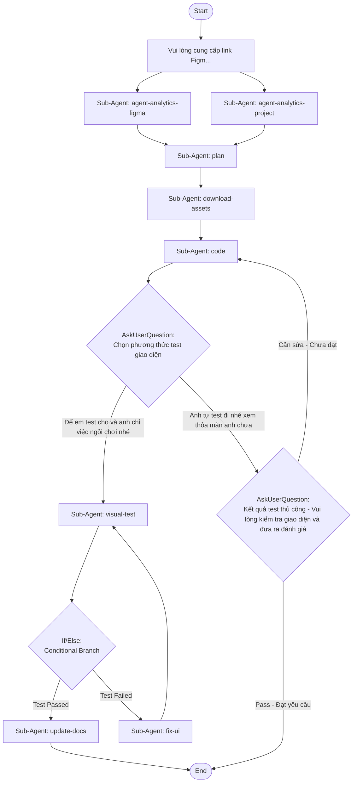

## Workflow Execution Guide

Follow the Mermaid flowchart above to execute the workflow. Each node type has specific execution methods as described below.

### Execution Methods by Node Type

- **Rectangle nodes (Sub-Agent: ...)**: Execute Sub-Agents
- **Diamond nodes (AskUserQuestion:...)**: Use the AskUserQuestion tool to prompt the user and branch based on their response
- **Diamond nodes (Branch/Switch:...)**: Automatically branch based on the results of previous processing (see details section)
- **Rectangle nodes (Prompt nodes)**: Execute the prompts described in the details section below

## Sub-Agent Node Details

#### agent_1770621158350(Sub-Agent: agent-analytics-figma)

**Description**: Phân tích thiết kế

**Model**: haiku

**Prompt**:

```
Bạn được cấp link Figma design. Hãy sử dụng Figma MCP tools để:
1. Lấy metadata và design context của design đó
2. Phân tích thiết kế để biết trong đó có các component nào có thể áp dụng (Input, Checkbox, Button,...)
3. Đề xuất các components có thể áp dụng
4. Phân tích responsive behavior và auto layout từ design có thể áp dụng, nhưng cần tuân thủ đúng giao diện thiết kế
5. **PHÂN TÍCH ASSETS:**
   - Liệt kê tất cả icons sử dụng trong design (lấy tên chính xác từ Figma)
   - Liệt kê tất cả images/graphics (xác định format và kích thước)
   - **PHÂN TÍCH KÍCH THƯỚC ẢNH BACKGROUND:**
     - Kiểm tra kích thước file của các background images
     - Nếu ảnh > 500KB: recommend export dạng JPG (compressed)
     - Nếu ảnh ≤ 500KB: có thể giữ SVG hoặc PNG
   - Ghi chú icon nào đã có trong src/assets/icons/sprites.svg, icon nào cần thêm
6. **CHỤP SCREENSHOT FIGMA:** Sử dụng Figma MCP get_screenshot để lấy ảnh thiết kế gốc, lưu vào thư mục tests/screenshots/figma/ với tên file theo format: [page-name]-figma.png
7. Trả lại kết quả phân tích chi tiết để agent sau có thể hiểu được

**LƯU Ý:** KHÔNG tạo file báo cáo .md - chỉ trả kết quả qua context để agent sau sử dụng
```

#### agent_1770621482261(Sub-Agent: agent-analytics-project)

**Description**: Đọc dự án hiện tại

**Model**: haiku

**Prompt**:

```
Thực hiện yêu cầu:
1. Đọc tất cả files trong docs/ folder của dự án để hiểu cấu trúc dự án, component
2. Xem src/components/custom/ để biết có các component nào đã có sẵn (không sửa đổi)
3. **KHÔNG đọc src/components/ui/** vì đó là base components của shadcn-vue (không sửa đổi)
4. **ĐỌC THÊM CONFIG FILES:**
   - Đọc tailwind.config.js để biết colors, spacing, breakpoints đang dùng
   - Đọc src/assets/styles/ để biết CSS variables và theme
   - Đọc các existing pages/layouts trong src/views/ hoặc src/pages/ để match coding patterns
5. Tổng hợp thông tin về design system hiện tại của dự án

**LƯU Ý:** KHÔNG tạo file báo cáo .md - chỉ trả kết quả qua context để agent sau sử dụng
```

#### agent_1770621677356(Sub-Agent: plan)

**Description**: Lên kế hoạch

**Model**: sonnet

**Prompt**:

```
Lấy kết quả từ node agent-analytics-figma và agent-analytics-project để tổng hợp lại xây dựng kế hoạch triển khai theo yêu cầu:

1. Match lại các component có thể áp dụng để viết giao diện
2. Đọc tài liệu của các component đã match bằng cách xem các file README.md, đọc file demo.vue để biết cách sử dụng của từng component đó
3. Kiểm tra src/assets/icons/sprites.svg để xem icons nào đã có sẵn, chưa có thì sẽ thêm dưới dạng svg sprite và đặt tên theo figma
4. **OUTPUT FORMAT - BẮT BUỘC:**
   - Danh sách components cần tạo mới (với file path cụ thể)
   - Danh sách components có sẵn sẽ sử dụng
   - Danh sách assets cần download (icons, images) với URL và destination path
   - File structure chi tiết
   - Mapping Figma tokens → Tailwind classes
5. Sử dụng /plan của Claudekit để lên kế hoạch với các yêu cầu bổ sung bên trên

**QUẢN LÝ FILE:**
- Nếu cần lưu file kế hoạch, CHỈ lưu vào thư mục /plans/
- KHÔNG tạo file .md ở thư mục gốc hoặc các thư mục khác
- Format: /plans/[YYMMDD]-[feature-name]-plan.md
```

#### agent_download_assets(Sub-Agent: download-assets)

**Description**: Download assets từ Figma

**Model**: haiku

**Prompt**:

```
Dựa vào kế hoạch từ Plan agent, thực hiện download tất cả assets cần thiết:

1. **ICONS:**
   - Sử dụng Figma MCP tools để export các icons dưới dạng SVG
   - Thêm các icons mới vào src/assets/icons/sprites.svg với đúng tên từ Figma
   - Đảm bảo format SVG chuẩn cho sprite usage

2. **IMAGES:**
   - Export images theo strategy đã phân tích:
     - Ảnh lớn/background > 500KB → JPG (compressed)
     - Ảnh nhỏ/transparent → PNG hoặc SVG
   - Lưu vào src/assets/images/[feature_name]/
   - Đặt tên file theo convention: kebab-case

3. **VERIFICATION:**
   - Kiểm tra tất cả assets đã download thành công
   - List ra các assets đã có và path của chúng
   - Báo lỗi nếu có asset nào không download được

4. Output danh sách assets đã download để Code agent sử dụng

**LƯU Ý:** KHÔNG tạo file báo cáo .md - chỉ trả kết quả qua context
```

#### agent_1770622516467(Sub-Agent: code)

**Description**: Triển khai code Vue + Tailwindcss

**Model**: opus

**Prompt**:

```
Hãy triển khai code theo kế hoạch, sử dụng lệnh /cook của Claudekit để thực hiện với các yêu cầu BẮT BUỘC:

⚠️ **RÀNG BUỘC NGHIÊM NGẶT - TUÂN THỦ CHÍNH XÁC THIẾT KẾ FIGMA:**

1. **KHÔNG được thay đổi bất kỳ điều gì trong thiết kế Figma:**
   - ❌ KHÔNG tự ý thêm components, sections, hoặc giao diện mới không có trong thiết kế, yêu cầu chỉ code những gì có trong thiết kế
   - ❌ KHÔNG thay đổi màu sắc, gradient, hoặc color scheme
   - ❌ KHÔNG thay đổi layout, spacing, hoặc positioning
   - ❌ KHÔNG thay đổi typography, font sizes, hoặc weights
   - ❌ KHÔNG thêm effects, shadows, hoặc animations không có trong design
   - ❌ KHÔNG thay đổi responsive breakpoints hoặc behavior
   - ❌ KHÔNG sáng tạo hoặc tự ý cải thiện giao diện
   - ❌ KHÔNG tự ý tùy chỉnh UI của components dùng chung (chúng đã đủ đáp ứng)
   - ❌ KHÔNG thêm CSS vào custom components - chỉ dùng className Tailwind
   - ❌ KHÔNG thêm component của tính năng vào src/components/custom/
2. **COMPONENT IMPLEMENTATION - BẮT BUỘC RULES:**
   - ✓ CHỈ sử dụng components từ src/components/custom/
   - ✓ KHÔNG sử dụng src/components/ui/ (base components của shadcn-vue - không được sửa, không sử dụng)
   - ✓ KHÔNG tùy chỉnh UI của custom components - sử dụng nguyên vẹn như thiết kế, chỉ áp dụng theo cách sử dụng của nó
   - ✓ Tổ chức components theo feature: src/components/[feature_name]/[component_name].vue
   - ✓ Gộp các components liên quan trong cùng thư mục feature
   - ✓ Hạn chế tách quá nhỏ - gom các logic liên quan lại (theo tính năng)
   - ✓ Import components dùng chung chính xác từ src/components/custom/

3. **ASSETS HANDLING:**
   - **Icons:** Sử dụng assets đã được download-assets agent chuẩn bị
   - **Images:** Import từ src/assets/images/[feature_name]/ đã được download

4. **RESPONSIVE DESIGN & AUTO LAYOUT:**
   - ✓ Implement responsive design cho TẤT CẢ screen sizes (mobile, tablet, desktop)
   - ✓ Sử dụng Tailwind responsive classes (sm:, md:, lg:, xl:) để match auto layout từ Figma
   - ✓ Ensure layout tự động adjust dựa theo viewport width
   - ✓ Maintain visual hierarchy trên tất cả screen sizes

5. **Code implementation rules:**
   - Sử dụng Vue 3 + TypeScript
   - Tailwind CSS: KHÔNG dùng @apply trong style, chỉ dùng className
   - Nếu không thể dùng Tailwind CSS, sử dụng SCSS + CSS Modules
   - Naming convention: snake_case cho variables, camelCase cho functions
   - Đảm bảo imports đúng path, component names đúng

**⚠️ QUAN TRỌNG - KHÔNG TẠO FILE THỪA:**
   - ❌ KHÔNG tạo file .md, README, hoặc tài liệu
   - ❌ KHÔNG tạo file báo cáo hoặc analysis
   - ✓ CHỈ tạo các file code (.vue, .ts, .scss) cần thiết cho tính năng
```

#### agent_visual_test(Sub-Agent: visual-test)

**Description**: Test visual với Playwright

**Model**: sonnet

**Prompt**:

```
Thực hiện visual regression test để so sánh giao diện code với thiết kế Figma:

**SETUP:**
- Dev server URL: https://dev.smit.team:8309
- Screenshot Figma đã được lưu tại: tests/screenshots/figma/

**QUY TRÌNH TEST:**

1. **Chạy Playwright screenshot:**
   - Navigate đến trang vừa implement trên dev server (https://dev.smit.team:8309)
   - Chụp screenshot full page và lưu vào tests/screenshots/actual/[page-name]-actual.png
   - Chụp ở các viewport: desktop (1920x1080), tablet (768x1024), mobile (375x667)

2. **SO SÁNH VISUAL:**
   - So sánh screenshot actual với screenshot Figma
   - Sử dụng pixel-by-pixel comparison hoặc visual diff
   - Tạo diff image nếu có sự khác biệt, lưu vào tests/screenshots/diff/

3. **ĐÁNH GIÁ:**
   - Liệt kê các điểm khác biệt (nếu có):
     - Màu sắc sai
     - Spacing/padding không đúng
     - Font size/weight khác
     - Layout bị lệch
     - Missing elements
   - Tính % độ giống nhau (similarity score)
   - Threshold chấp nhận: >= 95% similarity

4. **OUTPUT:**
   - test_passed: true/false
   - similarity_score: number (0-100)
   - differences: array of {element, issue, severity}
   - screenshots: {figma, actual, diff}

**LƯU Ý:** 
- Chỉ báo PASS nếu giao diện giống >= 95% thiết kế Figma
- KHÔNG tạo file báo cáo .md - chỉ trả kết quả qua context
```

#### agent_update_docs(Sub-Agent: update-docs)

**Description**: Cập nhật tài liệu tính năng

**Model**: haiku

**Prompt**:

```
Sau khi tính năng đã hoàn thành và pass visual test, cập nhật tài liệu cho tính năng:

**NHIỆM VỤ:**

1. **TẠO/CẬP NHẬT TÀI LIỆU TÍNH NĂNG:**
   - Tạo file tài liệu tại: /docs/[feature-name]/README.md
   - Nếu thư mục chưa tồn tại, tạo mới

2. **NỘI DUNG TÀI LIỆU BẮT BUỘC:**
   ```
   # [Tên tính năng]
   
   ## Tổng quan
   - Mô tả ngắn gọn tính năng
   - Link Figma design (nếu có)
   
   ## Cấu trúc files
   - Liệt kê các files đã tạo với đường dẫn
   - Mô tả ngắn chức năng từng file
   
   ## Components sử dụng
   - Danh sách components từ src/components/custom/ đã dùng
   - Cách sử dụng và props
   
   ## Luồng hoạt động
   - Mô tả flow chính của tính năng
   - Các states và interactions
   
   ## Assets
   - Icons đã thêm vào sprites.svg
   - Images trong src/assets/images/[feature]/
   
   ## Ghi chú phát triển
   - Các lưu ý quan trọng cho developer
   - Các edge cases cần xử lý
   ```

3. **CẬP NHẬT INDEX (nếu cần):**
   - Cập nhật /docs/README.md hoặc index để link đến tài liệu mới

**LƯU Ý:**
- Viết tài liệu ngắn gọn, súc tích
- Tập trung vào thông tin giúp AI/developer hiểu và maintain tính năng
- CHỈ tạo file trong thư mục /docs/[feature-name]/
```

#### agent_fix_ui(Sub-Agent: fix-ui)

**Description**: Sửa lỗi UI theo visual test

**Model**: sonnet

**Prompt**:

```
Dựa vào kết quả visual test đã fail, thực hiện sửa lỗi UI:

**INPUT:** Danh sách differences từ visual-test agent

**QUY TRÌNH SỬA:**

1. **PHÂN TÍCH LỖI:**
   - Đọc danh sách differences và severity
   - Ưu tiên sửa lỗi theo severity: critical > major > minor

2. **SỬA TỪNG LỖI:**
   - Màu sắc sai → Kiểm tra lại Figma design tokens, sửa Tailwind classes
   - Spacing sai → Điều chỉnh padding/margin/gap classes
   - Font sai → Sửa font-size, font-weight classes
   - Layout lệch → Kiểm tra flexbox/grid settings
   - Missing elements → Thêm elements còn thiếu

3. **RÀNG BUỘC:**
   - ❌ KHÔNG thay đổi logic hay structure không cần thiết
   - ❌ KHÔNG refactor code không liên quan đến lỗi
   - ❌ KHÔNG tạo file .md hoặc báo cáo
   - ✓ CHỈ sửa đúng những gì được báo trong differences
   - ✓ Giữ nguyên code đã hoạt động tốt

4. **OUTPUT:**
   - Danh sách files đã sửa
   - Mô tả từng thay đổi (qua context, không tạo file)
   - Ready for re-test

**LƯU Ý:** Sau khi sửa xong, workflow sẽ chạy lại visual test để verify
```

### Prompt Node Details

#### prompt_figma_link(Vui lòng cung cấp link Figm...)

```
Vui lòng cung cấp link Figma design mà bạn muốn triển khai thành code và cung cấp yêu cầu chi tiết nếu muốn mô tả thêm công việc cụ thể.
```

### AskUserQuestion Node Details

Ask the user and proceed based on their choice.

#### question_1773479912725(Chọn phương thức test giao diện)

**Selection mode:** Single Select (branches based on the selected option)

**Options:**
- **Để em test cho và anh chỉ việc ngồi chơi nhé**: AI sẽ sử dụng Playwright để chụp screenshot và so sánh visual với thiết kế Figma
- **Anh tự test đi nhé xem thỏa mãn anh chưa**: Bạn sẽ tự kiểm tra giao diện trên trình duyệt và đưa ra nhận xét

#### question_manual_feedback(Kết quả test thủ công - Vui lòng kiểm tra giao diện và đưa ra đánh giá)

**Selection mode:** Single Select (branches based on the selected option)

**Options:**
- **Pass - Đạt yêu cầu**: Giao diện đã đúng với thiết kế, hoàn thành tính năng
- **Cần sửa - Chưa đạt**: Giao diện chưa đúng, cần góp ý để AI sửa lại

### If/Else Node Details

#### ifelse_test_result(Binary Branch (True/False))

**Evaluation Target**: Kiểm tra kết quả visual test từ agent visual-test

**Branch conditions:**
- **Test Passed**: test_passed = true AND similarity_score >= 95%
- **Test Failed**: test_passed = false OR similarity_score < 95%

**Execution method**: Evaluate the results of the previous processing and automatically select the appropriate branch based on the conditions above.
