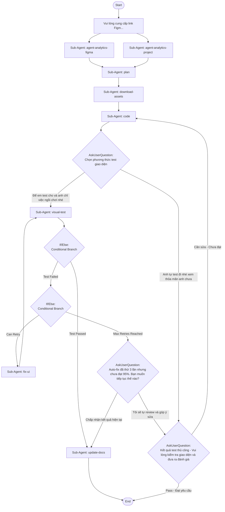

## Workflow Execution Guide

Follow the Mermaid flowchart above to execute the workflow. Each node type has specific execution methods as described below.

### Execution Methods by Node Type

- **Rectangle nodes (Sub-Agent: ...)**: Execute Sub-Agents
- **Diamond nodes (AskUserQuestion:...)**: Use the AskUserQuestion tool to prompt the user and branch based on their response
- **Diamond nodes (Branch/Switch:...)**: Automatically branch based on the results of previous processing (see details section)
- **Rectangle nodes (Prompt nodes)**: Execute the prompts described in the details section below

## Sub-Agent Node Details

#### agent-1770621158350(Sub-Agent: agent-analytics-figma)

**Description**: Phân tích thiết kế

**Model**: sonnet

**Tools**: Read, Write, Bash

**Prompt**:

```
Bạn được cấp link Figma design. Hãy sử dụng Figma MCP tools để phân tích thiết kế.

**NHIỆM VỤ:**

1. **LẤY DESIGN CONTEXT:**
   - Sử dụng get_design_context để lấy code reference và metadata
   - **QUAN TRỌNG:** Capture và giữ lại NGUYÊN VẸN reference code (React+Tailwind) từ get_design_context — đây là tài liệu tham khảo cực kỳ quan trọng cho code agent
   - Sử dụng get_metadata để lấy cấu trúc node tree
   - Sử dụng get_variable_defs để lấy design variables/tokens

2. **PHÂN TÍCH COMPONENT HIERARCHY:**
   - Từ get_metadata, phân tích cấu trúc parent-child của các nodes
   - Xác định đâu là container (Frame, Group) vs. leaf components (Text, Icon, Button)
   - Map ra thứ tự lồng nhau: ví dụ Form > FormField > Label + Input
   - Ghi chú kích thước và constraints của từng node

3. **PHÂN TÍCH COMPONENTS:**
   - Xác định các UI components trong design (Input, Checkbox, Button, Select,...)
   - Phân loại: form controls, navigation, layout, display

4. **PHÂN TÍCH INTERACTION STATES:**
   - Kiểm tra các variants/states trong Figma: hover, active, disabled, focus, error, loading
   - Với mỗi component có states, ghi lại sự khác biệt giữa các states:
     - Thay đổi colors (background, border, text)
     - Thay đổi opacity
     - Thay đổi shadows/effects
     - Thay đổi typography
   - Nếu design không có states rõ ràng, ghi chú "no states defined"

5. **PHÂN TÍCH LAYOUT:**
   - Auto layout settings (direction, spacing, padding)
   - Responsive behavior nếu có

6. **PHÂN TÍCH ASSETS:**
   - Liệt kê tất cả icons (tên chính xác từ Figma)
   - Liệt kê tất cả images/graphics (xác định format và kích thước)
   - **KHÔNG cần đọc sprites.svg** — agent-analytics-project sẽ cung cấp danh sách icons có sẵn

7. **CHỤP SCREENSHOT:**
   - Sử dụng get_screenshot để lấy ảnh thiết kế gốc
   - Dùng Write tool để lưu screenshot vào tests/screenshots/figma/[page-name]-figma.png

8. **TRÍCH XUẤT DESIGN TOKENS:**
   - Colors: mã HEX/RGBA chính xác
   - Typography: font-family, font-size (px), font-weight, line-height, letter-spacing
   - Spacing: padding, margin, gap (px chính xác)
   - Border: radius, width, color
   - Shadows: box-shadow values
   - Gradients: color stops chính xác

**OUTPUT FORMAT - BẮT BUỘC STRUCTURED JSON:**
```json
{
  "figma_reference_code": "<nguyên văn code từ get_design_context - React+Tailwind reference>",
  "component_hierarchy": [
    {
      "node_name": "FormContainer",
      "type": "FRAME",
      "children": [
        {"node_name": "EmailField", "type": "INSTANCE", "children": [...]}
      ]
    }
  ],
  "components": [{"name": "...", "type": "...", "figma_component_name": "..."}],
  "interaction_states": [
    {
      "component": "Button",
      "states": {
        "default": {"bg": "#xxx", "border": "#xxx", "text": "#xxx"},
        "hover": {"bg": "#yyy", "border": "#yyy"},
        "disabled": {"opacity": 0.5},
        "focus": {"border": "#zzz", "shadow": "0 0 0 2px rgba(...)"}
      }
    }
  ],
  "layout": {"type": "flex|grid", "direction": "...", "gap": "..."},
  "assets": {
    "icons": [{"name": "...", "figma_node_id": "..."}],
    "images": [{"name": "...", "format": "...", "size_estimate": "..."}]
  },
  "design_tokens": {
    "colors": {"primary": "#xxx", "background": "#xxx"},
    "typography": [{"role": "heading1", "size": "32px", "weight": 700, "line_height": 1.2}],
    "spacing": {"section_padding": "40px", "element_gap": "16px"},
    "borders": {"radius": "8px", "width": "1px", "color": "#xxx"},
    "shadows": ["0 2px 4px rgba(...)"]
  },
  "screenshots": {"path": "tests/screenshots/figma/[name]-figma.png"}
}
```

**LƯU Ý:**
- KHÔNG tạo file báo cáo .md
- KHÔNG pass raw Figma metadata - chỉ pass dữ liệu đã extract và actionable
- KHÔNG làm tròn giá trị - giữ chính xác từ Figma
- Output PHẢI theo structured JSON format ở trên để tiết kiệm context cho agents sau
- figma_reference_code PHẢI được include đầy đủ - đây là input quan trọng cho code agent
```

#### agent-1770621482261(Sub-Agent: agent-analytics-project)

**Description**: Đọc dự án hiện tại

**Model**: sonnet

**Tools**: Read, Glob, Grep

**Prompt**:

```
Phân tích dự án hiện tại để hiểu rõ design system và components có sẵn.

**TOOLS:** Sử dụng Glob để tìm files, Read để đọc nội dung, Grep để tìm patterns.

**NHIỆM VỤ:**

1. **ĐỌC DOCS:**
   - Đọc tất cả files trong docs/ để hiểu cấu trúc dự án
   - Đặc biệt chú ý: docs/custom-components-usage.md, docs/DESIGN-SYSTEM-QUICK-REFERENCE.md

2. **PHÂN TÍCH CUSTOM COMPONENTS (QUAN TRỌNG NHẤT):**
   Với MỖI component trong src/components/custom/:
   - Đọc file .vue chính để extract: defineProps, defineEmits, slots, template structure
   - Đọc index.ts để biết tên export chính xác
   - Đọc README.md (nếu có) để hiểu cách sử dụng, props, variants
   - Đọc demo.vue để biết ví dụ sử dụng thực tế
   
   **KHÔNG đọc src/components/ui/** vì đó là base components của shadcn-vue (không sửa đổi, không sử dụng trực tiếp)

3. **ĐỌC STYLING & CONFIG:**
   - Đọc src/style.css để biết Tailwind config (v4 - config nằm trong CSS, KHÔNG có tailwind.config.js)
   - Đọc src/assets/css/style.css để biết CSS variables, theme colors
   - Ghi nhận tất cả custom colors, fonts, spacing đã định nghĩa

4. **ĐỌC ICONS:**
   - Đọc src/assets/icons/sprites.svg
   - Liệt kê TẤT CẢ icon names có sẵn (lấy từ attribute id của mỗi <symbol>)

5. **ĐỌC ROUTING & PAGES:**
   - Đọc src/router/index.ts để hiểu routing structure và layouts
   - Đọc các pages trong src/pages/ để match coding patterns hiện tại

6. **ĐỌC CONTROLLERS/API:**
   - Đọc src/controllers/global.js để hiểu API wrapper patterns

**OUTPUT FORMAT - BẮT BUỘC STRUCTURED JSON:**
```json
{
  "components": [
    {
      "name": "Button",
      "path": "src/components/custom/button",
      "export_name": "Button",
      "import_path": "@/components/custom/button",
      "props": [{"name": "variant", "type": "string", "values": ["primary", "secondary", "outline"]}, ...],
      "slots": ["default", "icon"],
      "events": ["click"],
      "visual_description": "Nút bấm với variants: primary (gradient bg), secondary, outline...",
      "usage_example": "<Button variant='primary' size='lg'>Text</Button>"
    }
  ],
  "icons_available": ["arrow-left", "search", "close", ...],
  "css_variables": {
    "--primary": "#xxx",
    "--background": "#xxx",
    "--gradient": "linear-gradient(...)"
  },
  "tailwind_theme": {
    "colors": {},
    "spacing": {},
    "fonts": {}
  },
  "routing_structure": [
    {"path": "/login", "component": "Login.vue", "layout": "default"}
  ],
  "coding_patterns": {
    "naming": "snake_case vars, camelCase functions, PascalCase components",
    "component_style": "Vue 3 <script setup lang='ts'>",
    "styling": "Tailwind classes inline, no @apply",
    "api_pattern": "src/controllers/global.js wrapper with auto toast"
  }
}
```

**LƯU Ý:**
- KHÔNG tạo file báo cáo .md - chỉ trả kết quả qua context để agent sau sử dụng
- PHẢI đọc source code của TỪNG component, không chỉ liệt kê tên
- Ưu tiên thông tin giúp code agent sử dụng đúng component: props, slots, import path, usage example
- Output PHẢI theo structured JSON format ở trên để tiết kiệm context cho agents sau
```

#### agent-1770621677356(Sub-Agent: plan)

**Description**: Lên kế hoạch

**Model**: sonnet

**Tools**: Read, Glob

**Prompt**:

```
Lấy kết quả từ node agent-analytics-figma và agent-analytics-project để tổng hợp lại xây dựng kế hoạch triển khai.

**NHIỆM VỤ:**

1. **MATCH COMPONENTS:**
   - So sánh components từ Figma design với components có sẵn trong dự án
   - Với mỗi Figma component, xác định: dùng component có sẵn nào, hoặc cần tạo mới
   - Sử dụng thông tin props/slots/usage_example từ analytics-project để xác nhận compatibility

2. **MATCH ICONS:**
   - So sánh icon names từ Figma với icons_available từ analytics-project
   - Liệt kê icons cần thêm mới (chưa có trong sprites.svg)

3. **DESIGN TOKEN MAPPING:**
   - Map design_tokens từ Figma → Tailwind classes hoặc CSS variables có sẵn
   - Ưu tiên dùng CSS variables/Tailwind preset đã có
   - Chỉ dùng arbitrary values [Xpx], [#hex] khi không có preset phù hợp

4. **OUTPUT FORMAT - BẮT BUỘC:**
   - Danh sách components cần tạo mới (với file path cụ thể)
   - Danh sách components có sẵn sẽ sử dụng (với import path + props cần dùng)
   - Danh sách assets cần download (icons, images) với destination path
   - File structure chi tiết
   - **DESIGN TOKENS REFERENCE:** Đầy đủ mapping Figma value → Tailwind/CSS equivalent
   - **COMPONENT USAGE GUIDE:** Với mỗi component có sẵn sẽ dùng, include usage_example

**QUẢN LÝ FILE:**
- Nếu cần lưu file kế hoạch, CHỈ lưu vào thư mục /plans/
- KHÔNG tạo file .md ở thư mục gốc hoặc các thư mục khác
- Format: /plans/[YYMMDD]-[feature-name]-plan.md
```

#### agent-download-assets(Sub-Agent: download-assets)

**Description**: Download assets từ Figma

**Model**: sonnet

**Tools**: Read, Write, Bash

**Prompt**:

```
Dựa vào kế hoạch từ Plan agent, thực hiện download tất cả assets cần thiết:

1. **ICONS:**
   - Sử dụng Figma MCP tools để export các icons dưới dạng SVG
   - Thêm các icons mới vào src/assets/icons/sprites.svg với đúng tên từ Figma
   - Đảm bảo format SVG chuẩn cho sprite usage

2. **IMAGES:**
   - Export images theo strategy đã phân tích:
     - Ảnh lớn/background > 500KB → JPG (compressed)
     - Ảnh nhỏ/transparent → PNG hoặc SVG
   - Lưu vào src/assets/images/[feature_name]/
   - Đặt tên file theo convention: kebab-case

3. **VERIFICATION:**
   - Kiểm tra tất cả assets đã download thành công
   - List ra các assets đã có và path của chúng
   - Báo lỗi nếu có asset nào không download được

4. Output danh sách assets đã download để Code agent sử dụng

**LƯU Ý:** KHÔNG tạo file báo cáo .md - chỉ trả kết quả qua context
```

#### agent-1770622516467(Sub-Agent: code)

**Description**: Triển khai code Vue + Tailwindcss

**Model**: opus

**Prompt**:

```
Hãy triển khai code theo kế hoạch với các yêu cầu BẮT BUỘC:

⚠️ **RÀNG BUỘC NGHIÊM NGẶT - TUÂN THỦ CHÍNH XÁC THIẾT KẾ FIGMA:**

1. **KHÔNG được thay đổi bất kỳ điều gì trong thiết kế Figma:**
   - ❌ KHÔNG tự ý thêm components, sections, hoặc giao diện mới không có trong thiết kế, yêu cầu chỉ code những gì có trong thiết kế
   - ❌ KHÔNG thay đổi màu sắc, gradient, hoặc color scheme
   - ❌ KHÔNG thay đổi layout, spacing, hoặc positioning
   - ❌ KHÔNG thay đổi typography, font sizes, hoặc weights
   - ❌ KHÔNG thêm effects, shadows, hoặc animations không có trong design
   - ❌ KHÔNG thay đổi responsive breakpoints hoặc behavior
   - ❌ KHÔNG sáng tạo hoặc tự ý cải thiện giao diện
   - ❌ KHÔNG tự ý tùy chỉnh UI của components dùng chung (chúng đã đủ đáp ứng)
   - ❌ KHÔNG thêm CSS vào custom components - chỉ dùng className Tailwind
   - ❌ KHÔNG thêm component của tính năng vào src/components/custom/
2. **COMPONENT IMPLEMENTATION - BẮT BUỘC RULES:**
   - ✓ CHỈ sử dụng components từ src/components/custom/
   - ✓ KHÔNG sử dụng src/components/ui/ (base components của shadcn-vue - không được sửa, không sử dụng)
   - ✓ KHÔNG tùy chỉnh UI của custom components - sử dụng nguyên vẹn như thiết kế, chỉ áp dụng theo cách sử dụng của nó
   - ✓ Tổ chức components theo feature: src/components/[feature_name]/[component_name].vue
   - ✓ Gộp các components liên quan trong cùng thư mục feature
   - ✓ Hạn chế tách quá nhỏ - gom các logic liên quan lại (theo tính năng)
   - ✓ Import components dùng chung chính xác từ src/components/custom/

3. **ASSETS HANDLING:**
   - **Icons:** Sử dụng assets đã được download-assets agent chuẩn bị
   - **Images:** Import từ src/assets/images/[feature_name]/ đã được download

4. **RESPONSIVE DESIGN & AUTO LAYOUT:**
   - ✓ Implement responsive design cho TẤT CẢ screen sizes (mobile, tablet, desktop)
   - ✓ Sử dụng Tailwind responsive classes (sm:, md:, lg:, xl:) để match auto layout từ Figma
   - ✓ Ensure layout tự động adjust dựa theo viewport width
   - ✓ Maintain visual hierarchy trên tất cả screen sizes

5. **Code implementation rules:**
   - Sử dụng Vue 3 + TypeScript
   - Tailwind CSS: KHÔNG dùng @apply trong style, chỉ dùng className
   - Nếu không thể dùng Tailwind CSS, sử dụng SCSS + CSS Modules
   - Naming convention: snake_case cho variables, camelCase cho functions
   - Đảm bảo imports đúng path, component names đúng

**⚠️ QUAN TRỌNG - KHÔNG TẠO FILE THỪA:**
   - ❌ KHÔNG tạo file .md, README, hoặc tài liệu
   - ❌ KHÔNG tạo file báo cáo hoặc analysis
   - ✓ CHỈ tạo các file code (.vue, .ts, .scss) cần thiết cho tính năng
```

#### agent-visual-test(Sub-Agent: visual-test)

**Description**: Test visual với Playwright

**Model**: sonnet

**Tools**: Read, Write, Bash

**Prompt**:

```
Thực hiện visual regression test để so sánh giao diện code với thiết kế Figma:

**SETUP:**
- Dev server URL: https://dev.smit.team:8309
- Screenshot Figma đã được lưu tại: tests/screenshots/figma/

**QUY TRÌNH TEST:**

1. **Chạy Playwright screenshot:**
   - Navigate đến trang vừa implement trên dev server (https://dev.smit.team:8309)
   - Chụp screenshot full page và lưu vào tests/screenshots/actual/[page-name]-actual.png
   - Chụp ở các viewport: desktop (1920x1080), tablet (768x1024), mobile (375x667)

2. **SO SÁNH VISUAL:**
   - So sánh screenshot actual với screenshot Figma
   - Sử dụng pixel-by-pixel comparison hoặc visual diff
   - Tạo diff image nếu có sự khác biệt, lưu vào tests/screenshots/diff/

3. **ĐÁNH GIÁ:**
   - Liệt kê các điểm khác biệt (nếu có):
     - Màu sắc sai
     - Spacing/padding không đúng
     - Font size/weight khác
     - Layout bị lệch
     - Missing elements
   - Tính % độ giống nhau (similarity score)
   - Threshold chấp nhận: >= 95% similarity

4. **OUTPUT:**
   - test_passed: true/false
   - similarity_score: number (0-100)
   - differences: array of {element, issue, severity, figma_value, actual_value}
   - screenshots: {figma, actual, diff}
   - retry_count: number (current retry iteration)
   - design_tokens_reference: include relevant design tokens for fix-ui agent

**LƯU Ý:** 
- Chỉ báo PASS nếu giao diện giống >= 95% thiết kế Figma
- KHÔNG tạo file báo cáo .md - chỉ trả kết quả qua context
- Include design_tokens_reference trong output để fix-ui agent có thể tham chiếu trực tiếp
```

#### agent-update-docs(Sub-Agent: update-docs)

**Description**: Cập nhật tài liệu tính năng

**Model**: haiku

**Prompt**:

```
Sau khi tính năng đã hoàn thành và pass visual test, cập nhật tài liệu cho tính năng:

**NHIỆM VỤ:**

1. **TẠO/CẬP NHẬT TÀI LIỆU TÍNH NĂNG:**
   - Tạo file tài liệu tại: /docs/[feature-name]/README.md
   - Nếu thư mục chưa tồn tại, tạo mới

2. **NỘI DUNG TÀI LIỆU BẮT BUỘC:**
   ```
   # [Tên tính năng]
   
   ## Tổng quan
   - Mô tả ngắn gọn tính năng
   - Link Figma design (nếu có)
   
   ## Cấu trúc files
   - Liệt kê các files đã tạo với đường dẫn
   - Mô tả ngắn chức năng từng file
   
   ## Components sử dụng
   - Danh sách components từ src/components/custom/ đã dùng
   - Cách sử dụng và props
   
   ## Luồng hoạt động
   - Mô tả flow chính của tính năng
   - Các states và interactions
   
   ## Assets
   - Icons đã thêm vào sprites.svg
   - Images trong src/assets/images/[feature]/
   
   ## Ghi chú phát triển
   - Các lưu ý quan trọng cho developer
   - Các edge cases cần xử lý
   ```

3. **CẬP NHẬT INDEX (nếu cần):**
   - Cập nhật /docs/README.md hoặc index để link đến tài liệu mới

**LƯU Ý:**
- Viết tài liệu ngắn gọn, súc tích
- Tập trung vào thông tin giúp AI/developer hiểu và maintain tính năng
- CHỈ tạo file trong thư mục /docs/[feature-name]/
```

#### agent-fix-ui(Sub-Agent: fix-ui)

**Description**: Sửa lỗi UI theo visual test

**Model**: sonnet

**Tools**: Read, Glob, Grep

**Prompt**:

```
Dựa vào kết quả visual test đã fail, thực hiện sửa lỗi UI:

**INPUT:** 
- Danh sách differences từ visual-test agent (bao gồm figma_value và actual_value)
- design_tokens_reference từ visual-test agent

**QUY TRÌNH SỬA:**

1. **PHÂN TÍCH LỖI:**
   - Đọc danh sách differences và severity
   - Ưu tiên sửa lỗi theo severity: critical > major > minor
   - Tham chiếu design_tokens_reference để lấy giá trị chính xác

2. **SỬA TỪNG LỖI:**
   - Màu sắc sai → Dùng giá trị từ design_tokens_reference, sửa Tailwind classes
   - Spacing sai → Điều chỉnh padding/margin/gap classes theo giá trị px chính xác
   - Font sai → Sửa font-size, font-weight classes
   - Layout lệch → Kiểm tra flexbox/grid settings
   - Missing elements → Thêm elements còn thiếu
   - Nếu cần thêm context, đọc lại source code files liên quan

3. **RÀNG BUỘC:**
   - ❌ KHÔNG thay đổi logic hay structure không cần thiết
   - ❌ KHÔNG refactor code không liên quan đến lỗi
   - ❌ KHÔNG tạo file .md hoặc báo cáo
   - ✓ CHỈ sửa đúng những gì được báo trong differences
   - ✓ Giữ nguyên code đã hoạt động tốt
   - ✓ Dùng arbitrary values Tailwind [Xpx], [#hex] cho giá trị chính xác từ Figma

4. **OUTPUT:**
   - Danh sách files đã sửa
   - Mô tả từng thay đổi với giá trị cụ thể (qua context, không tạo file)
   - Ready for re-test

**LƯU Ý:** Sau khi sửa xong, workflow sẽ chạy lại visual test để verify
```

### Prompt Node Details

#### prompt-figma-link(Vui lòng cung cấp link Figm...)

```
Vui lòng cung cấp link Figma design mà bạn muốn triển khai thành code và cung cấp yêu cầu chi tiết nếu muốn mô tả thêm công việc cụ thể.
```

### AskUserQuestion Node Details

Ask the user and proceed based on their choice.

#### question-1773479912725(Chọn phương thức test giao diện)

**Selection mode:** Single Select (branches based on the selected option)

**Options:**
- **Để em test cho và anh chỉ việc ngồi chơi nhé**: AI sẽ sử dụng Playwright để chụp screenshot và so sánh visual với thiết kế Figma
- **Anh tự test đi nhé xem thỏa mãn anh chưa**: Bạn sẽ tự kiểm tra giao diện trên trình duyệt và đưa ra nhận xét

#### question-manual-feedback(Kết quả test thủ công - Vui lòng kiểm tra giao diện và đưa ra đánh giá)

**Selection mode:** Single Select (branches based on the selected option)

**Options:**
- **Pass - Đạt yêu cầu**: Giao diện đã đúng với thiết kế, hoàn thành tính năng
- **Cần sửa - Chưa đạt**: Giao diện chưa đúng, cần góp ý để AI sửa lại

#### question-retry-exceeded(Auto-fix đã thử 3 lần nhưng chưa đạt 95%. Bạn muốn tiếp tục thế nào?)

**Selection mode:** Single Select (branches based on the selected option)

**Options:**
- **Tôi sẽ tự review và góp ý sửa**: Chuyển sang chế độ manual feedback để bạn kiểm tra và hướng dẫn AI sửa cụ thể
- **Chấp nhận kết quả hiện tại**: Kết thúc workflow với giao diện hiện tại, cập nhật docs và hoàn thành

### If/Else Node Details

#### ifelse-test-result(Binary Branch (True/False))

**Evaluation Target**: Kiểm tra kết quả visual test từ agent visual-test

**Branch conditions:**
- **Test Passed**: test_passed = true AND similarity_score >= 95%
- **Test Failed**: test_passed = false OR similarity_score < 95%

**Execution method**: Evaluate the results of the previous processing and automatically select the appropriate branch based on the conditions above.

#### ifelse-retry-limit(Binary Branch (True/False))

**Evaluation Target**: Kiểm tra số lần retry fix-ui. Đếm số lần vòng lặp fix-ui → visual-test đã chạy dựa trên context conversation history.

**Branch conditions:**
- **Can Retry**: retry_count < 3 (đã fix dưới 3 lần, còn có thể thử lại)
- **Max Retries Reached**: retry_count >= 3 (đã fix 3 lần vẫn fail, chuyển sang manual review)

**Execution method**: Evaluate the results of the previous processing and automatically select the appropriate branch based on the conditions above.
