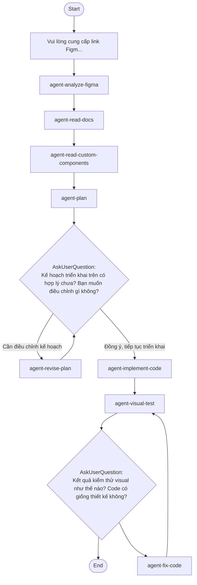

## Workflow Execution Guide

Follow the Mermaid flowchart above to execute the workflow. Each node type has specific execution methods as described below.

### Execution Methods by Node Type

- **Rectangle nodes**: Execute Sub-Agents using the Task tool
- **Diamond nodes (AskUserQuestion:...)**: Use the AskUserQuestion tool to prompt the user and branch based on their response
- **Diamond nodes (Branch/Switch:...)**: Automatically branch based on the results of previous processing (see details section)
- **Rectangle nodes (Prompt nodes)**: Execute the prompts described in the details section below

### Prompt Node Details

#### prompt_figma_link(Vui lòng cung cấp link Figm...)

```
Vui lòng cung cấp link Figma design mà bạn muốn triển khai thành code.
```

### AskUserQuestion Node Details

Ask the user and proceed based on their choice.

#### ask_approve_plan(Kế hoạch triển khai trên có hợp lý chưa? Bạn muốn điều chỉnh gì không?)

**Selection mode:** Single Select (branches based on the selected option)

**Options:**
- **Đồng ý, tiếp tục triển khai**: Tiến hành implement code theo kế hoạch
- **Cần điều chỉnh kế hoạch**: Muốn sửa lại một số phần trong kế hoạch

#### ask_visual_result(Kết quả kiểm thử visual như thế nào? Code có giống thiết kế không?)

**Selection mode:** AI Suggestions (AI generates options dynamically based on context and presents them to the user)
