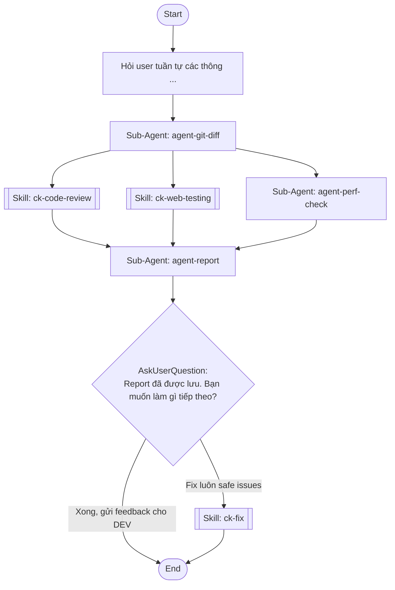

## Workflow Execution Guide

Follow the Mermaid flowchart above to execute the workflow. Each node type has specific execution methods as described below.

### Execution Methods by Node Type

- **Rectangle nodes (Sub-Agent: ...)**: Execute Sub-Agents
- **Diamond nodes (AskUserQuestion:...)**: Use the AskUserQuestion tool to prompt the user and branch based on their response
- **Diamond nodes (Branch/Switch:...)**: Automatically branch based on the results of previous processing (see details section)
- **Rectangle nodes (Prompt nodes)**: Execute the prompts described in the details section below

## Sub-Agent Node Details

#### agent-git-diff(Sub-Agent: agent-git-diff)

**Description**: Lấy git diff của branch hoặc commit cụ thể

**Model**: sonnet

**Prompt**:

```
Lấy git diff theo thứ tự ưu tiên:

CÁCH A (branch): git diff main...[branch] -- "*.vue" "*.ts" "*.js" + git log main...[branch] --oneline
CÁCH B (commit): git diff [from]..HEAD -- "*.vue" "*.ts" "*.js" + git log [from]..HEAD --oneline
FALLBACK: git branch --show-current → nếu không phải main dùng Cách A, nếu main hiển thị 10 commits gần nhất

Sau khi lấy diff:
1. git diff --name-only [range] → danh sách files
2. git log --format="%s%n%b" [range] → commit messages đầy đủ
3. Tìm keywords trong commits: TODO, FIXME, hotfix, temporary, workaround → lưu commit_intents

Map changed_files → URLs bằng router thực tế:
- Đọc src/router/index.ts, parse routes {path, component}
- pages/X.vue → tìm path trong router
- components/X → tìm pages import nó → map URL
- layout/X → tất cả routes dùng layout đó
- store/composable → tìm pages dùng → map URL
Kết quả: inferred_urls từ router, không hardcode

Output JSON (giá trị thực, không ví dụ):
{"review_mode":"branch|commit-range|fallback","diff_content":"<thực>","changed_files":["<thực>"],"inferred_urls":["<thực>"],"commits":["<thực>"],"commit_intents":["<keyword: context>"],"test_urls":[],"test_steps":[],"review_types":["logic"]}

review_types: 1→["logic"], 2→["ui"], 3→["performance"], 4→["logic","ui","performance"]
KHÔNG tạo file - trả qua context
```

#### agent-perf-check(Sub-Agent: agent-perf-check)

**Description**: Kiểm tra bundle size và performance

**Model**: sonnet

**Prompt**:

```
Nếu review_types KHÔNG chứa 'performance': trả {"skipped":true} và dừng.

BƯỚC 1 — XÁC ĐỊNH URL:
- Dùng test_urls[0] nếu có, mặc định: https://localhost:8309
- Verify: curl -sk <url> -o /dev/null -w "%{http_code}" → 200/3xx là OK
- Nếu fail: lsof -i :8309 | head -3. Vẫn không có: HỎI USER port. Không có server: lighthouse_skipped=true.

BƯỚC 2 — LIGHTHOUSE (HTTPS tự ký → BẮT BUỘC --ignore-certificate-errors --no-sandbox):
(A) Desktop: lighthouse <url> --preset=desktop --chrome-flags="--headless --ignore-certificate-errors --no-sandbox" --output=json --quiet --only-categories=performance
(B) Mobile 3G: thêm --throttling-method=simulate --throttling.cpuSlowdownMultiplier=4

Parse: categories.performance.score(*100), audits[fcp/lcp/tbt/cls/tti].displayValue
Ngưỡng: FCP<1.8s tốt; LCP<2.5s tốt/>4s kém; TBT<200ms tốt.

⚠️ CẢNH BÁO QUAN TRỌNG — in rõ trong báo cáo:
"Kết quả Lighthouse đo trên localhost (dev mode) — KHÔNG đại diện cho production.
 Localhost thiếu: CDN, caching headers, minified bundle, real network latency.
 Score thực tế trên production thường cao hơn 15-25 điểm (bundle minified, CDN).
 Để đo chính xác: chạy npm run build → serve dist → đo lại."

BƯỚC 3 — STATIC ANALYSIS TỪ DIFF:
(1) packages mới >50KB, (2) import không tree-shake, (3) ảnh thiếu loading=lazy, (4) API gọi lại mỗi mount không cache.
Nếu LCP>2.5s: tìm resource block render, bundle >200KB.

Output JSON: {"lighthouse_desktop":{...},"lighthouse_mobile":{...},"lighthouse_skipped":false,"localhost_warning":true,"bottlenecks":[],"static_analysis":{}}
```

#### agent-report(Sub-Agent: agent-report)

**Description**: Tổng hợp, phân tích, đề xuất giải pháp + định hướng tư duy + ghi báo cáo

**Model**: sonnet

**Prompt**:

```
Tổng hợp kết quả. CHỈ render section theo review_types.

### 📋 KẾT QUẢ REVIEW
**Branch:** ... | **Files:** X | **Verdict:** 🔴BLOCK/🟡REVIEW/🟢PASS

Nếu 'logic': ### 🔴 CODE ISSUES
| # | File | Vấn đề | Giải pháp hiện tại | Giải pháp tốt hơn | Tại sao |
Security issues: 🔒 severity=CRITICAL

Nếu 'ui': ### 🖥️ UI/VISUAL TEST
| Trang | Desktop | Tablet | Mobile | Vấn đề | Giải pháp |

Nếu 'performance': ### ⚡ PERFORMANCE
⚠️ Localhost ≠ production (thiếu CDN, minify). Score thực tế cao hơn 15-25 điểm.
| Metric | Desktop | Mobile 3G | Đánh giá |

### 🎯 COMMIT INTENT
Với mỗi issue: nếu commit message giải thích lý do → "⚠️ Có thể intentional". Nếu có TODO/FIXME → "📌 DEV biết". Không bỏ issue, chỉ giảm severity.

### 📊 SO SÁNH LẦN REVIEW TRƯỚC
Tìm plans/reports/review-*-{branch}.md gần nhất. Nếu có: ✅RESOLVED / ⚠️STILL OPEN / 🆕NEW. Nếu không: bỏ qua.

### 🔗 CROSS-VALIDATION: nhóm issues liên quan giữa sections, tránh trùng.
### 📝 PHƯƠNG ÁN: ưu tiên cao/trung bình + 🧭 định hướng tư duy
### 💬 FEEDBACK GỬI DEV [message copy-paste]

Verdict: BLOCK=security/critical; REVIEW=warnings; PASS=minor.

GHI FILE: plans/reports/review-{date +%y%m%d-%H%M}-{branch}.md với full report + root cause.
```

## Skill Nodes

#### skill-code-review(ck-code-review)

- **Prompt**: skill "ck-code-review" "Nếu review_types KHÔNG chứa 'logic': trả {"skipped":true,"issues":[]} và dừng.

① Đọc docs/code-standards.md để lấy conventions thực tế.

② Review code conventions (tiêu chí cụ thể, không chung chung):
- Naming: snake_case vars, camelCase funcs, PascalCase components
- Vue3: v-for dùng item.id làm :key (không dùng index), defineEmits<{...}>() đúng type, prop có required/default
- TS: không dùng any, kiểm tra null trước khi access property, computed không có side effect
- DRY/YAGNI: logic lặp >2 lần không tách hàm, component dùng 1 lần không cần tách

③ Review cấu trúc module (đọc src/):
- Component đặt đúng layer? (pages/ vs components/ vs layouts/)
- Feature tách module riêng? (components/staff/, components/auth/,...)
- File >200 lines? Logic nghiệp vụ lẫn vào component?
- Circular dependency?

④ Security checklist (bắt buộc, kiểm tra từng điểm):
- v-html: có dùng với nội dung user input không? → flag ngay nếu có
- console.log: có in ra token/password/sensitive data không?
- API key hoặc secret hardcode trong source không?
- localStorage: có lưu token/password dạng plaintext không?
- vite proxy: có expose endpoint nhạy cảm không?

Phân loại: safe_to_fix (naming/lint) vs needs_dev (logic/security)
Security issues luôn là needs_dev và severity=critical."

#### skill-visual-test(ck-web-testing)

- **Prompt**: skill "ck-web-testing" "Nếu review_types KHÔNG chứa 'ui': trả {"status":"skipped","overall":"skipped"} và dừng.

BƯỚC 1 — XÁC ĐỊNH URLs VÀ PRECONDITIONS:
- Merge: test_urls (user cung cấp) + inferred_urls (từ changed_files qua router)
- Với mỗi URL, xác định preconditions:
  * Cần đăng nhập không? (pages trong /app/* thường cần auth)
  * Cần data có sẵn không? (trang list cần có items, trang detail cần có id)
  * Cần chọn tab/state trước không?
- Nếu URL cần auth: thực hiện login flow trước (email/password từ test data hoặc hỏi user)
- Nếu không rõ preconditions: HỎI USER cụ thể trước khi test

BƯỚC 2 — VERIFY SERVER:
- curl -sk https://localhost:8309 → 200/3xx là OK (ignoreHTTPSErrors tự động)
- Nếu fail: HỎI USER port. Không có server: chạy static analysis thay thế.

BƯỚC 3 — LIVE TEST mỗi URL (Playwright + playwright.config.ts):
- 4 profiles: Desktop 1920px, HD 1366px, iPhone 14 (390px), iPad (810px)
- Chụp screenshot mỗi breakpoint → tìm overflow, element chồng nhau, text bị cắt
- Interactive: dropdown mở/đóng, button click, modal, form validation, tab/accordion
- Font: không fallback sang serif, tiếng Việt có dấu đúng
- Thực hiện test_steps nếu user cung cấp (đúng thứ tự, đúng URL tương ứng)

BƯỚC 4 — STATIC ANALYSIS (nếu không có server):
Từ diff tìm: z-index conflict, overflow:hidden trên dropdown parent, hardcoded width/height

Output JSON: {"status":"tested|static_only|skipped","pages_tested":[{"url":"","preconditions_met":true,"breakpoints":{},"issues":[]}],"overall":"pass|fail|skipped"}"

#### skill-auto-fix(ck-fix)

- **Prompt**: skill "ck-fix" "Fix các safe issues từ code review report --quick:

CHỈ fix những issues được đánh dấu safe_to_fix:
- Naming convention violations (snake_case, camelCase)
- Missing v-for :key bindings
- Unused imports
- console.log/debugger thừa

TUYỆT ĐỐI KHÔNG fix:
- Logic bugs (không chắc intent của DEV)
- Component structure changes
- State management
- Bất kỳ thứ có thể thay đổi behavior

Sau khi fix: list files đã sửa, KHÔNG tự commit, hỏi user confirm"

### Prompt Node Details

#### prompt-branch-input(Hỏi user tuần tự các thông ...)

```
Hỏi user tuần tự các thông tin sau, hỏi từng câu một và chờ trả lời trước khi hỏi tiếp:

---

**[1/3 — BẮT BUỘC] Loại review muốn thực hiện:**

Chọn một hoặc nhiều:
- **1 — Logic code**: review naming, DRY, YAGNI, TypeScript types, Vue 3 patterns, potential bugs
- **2 — Giao diện UI**: test layout responsive (Desktop/Tablet/Mobile), dropdown, button, form, modal, text rendering
- **3 — Performance**: đo tốc độ tải trang, LCP/FCP/TBT, bundle size, bottlenecks trên máy yếu/mạng 3G
- **4 — Tất cả** (mặc định nếu không chọn)

---

**[2/3 — BẮT BUỘC] Phạm vi code cần review** — chọn 1 trong 2 cách:

- **Cách A — Branch diff**: Branch name cần review so với main, ví dụ: `feat/staff-management`
- **Cách B — Commit range**: Commit ID bắt đầu đến HEAD, ví dụ: `abc1234`
  (Nếu không nhớ: AI sẽ hiển thị 10 commits gần nhất để chọn)

Nếu không cung cấp gì: dùng current branch so với main.

---

**[3/3 — CHỈ hỏi khi câu [1/3] có chọn "2" hoặc "4"] Thông tin test giao diện:**

- **URL(s) cần test**: ví dụ `https://localhost:8309/register`
  (Nếu không có: AI tự suy luận từ changed_files + router)
- **Các bước để đến giao diện đó**: ví dụ "1. Vào /register → 2. Điền form → 3. Submit"
  (Nếu không có: AI tự suy luận từ code)

Nếu câu [1/3] chỉ chọn "1" hoặc "3": bỏ qua câu này, chuyển thẳng sang agent-git-diff.
```

### AskUserQuestion Node Details

Ask the user and proceed based on their choice.

#### ask-fix-action(Report đã được lưu. Bạn muốn làm gì tiếp theo?)

**Selection mode:** Single Select (branches based on the selected option)

**Options:**
- **Fix luôn safe issues**: AI sửa naming, missing :key, unused imports ngay bây giờ
- **Xong, gửi feedback cho DEV**: Lấy message copy-paste để gửi DEV
