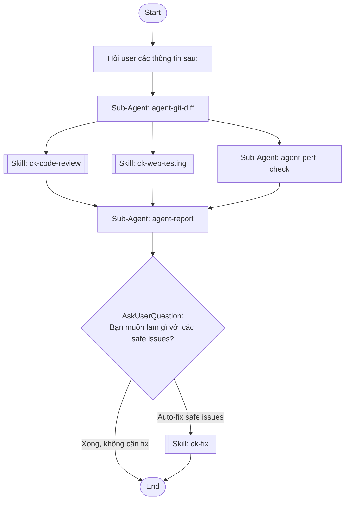

## Workflow Execution Guide

Follow the Mermaid flowchart above to execute the workflow. Each node type has specific execution methods as described below.

### Execution Methods by Node Type

- **Rectangle nodes (Sub-Agent: ...)**: Execute Sub-Agents
- **Diamond nodes (AskUserQuestion:...)**: Use the AskUserQuestion tool to prompt the user and branch based on their response
- **Diamond nodes (Branch/Switch:...)**: Automatically branch based on the results of previous processing (see details section)
- **Rectangle nodes (Prompt nodes)**: Execute the prompts described in the details section below

## Sub-Agent Node Details

#### agent-git-diff(Sub-Agent: agent-git-diff)

**Description**: Lấy git diff của branch hoặc commit cụ thể

**Model**: haiku

**Prompt**:

```
Lấy git diff để review code mới theo thứ tự ưu tiên:

**CÁCH A — Branch diff** (nếu user cung cấp branch name):
  `git diff main...[branch-name] -- "*.vue" "*.ts" "*.js"`
  Lấy commit list: `git log main...[branch-name] --oneline`

**CÁCH B — Commit range** (nếu user cung cấp commit ID bắt đầu):
  `git diff [from-commit]..HEAD -- "*.vue" "*.ts" "*.js"`
  Lấy commit list: `git log [from-commit]..HEAD --oneline`

**FALLBACK** (nếu không có gì):
  - Lấy current branch: `git branch --show-current`
  - Nếu không phải main: dùng Cách A với current branch
  - Nếu là main: hiển thị 10 commits gần nhất (`git log --oneline -10`) và yêu cầu user chọn from-commit

Sau khi xác định nguồn diff:
1. Lấy diff content
2. Lấy danh sách files thay đổi: `git diff --name-only [range]`
3. Lấy commit messages trong range

Output JSON:
{
  "review_mode": "branch | commit-range | fallback",
  "branch": "feat/staff-management hoặc null",
  "from_commit": "abc1234 hoặc null",
  "to_commit": "HEAD",
  "diff_content": "...",
  "changed_files": ["src/pages/app/Staff.vue"],
  "commits": ["abc1234 feat: add staff page", "def5678 fix: form validation"],
  "test_urls": [] hoặc ["http://localhost:8309/staff"],
  "test_steps": [] hoặc ["1. Vào /staff", "2. Click Thêm"],
  "has_fix_flag": true,
  "special_requirements": "both"
}

LƯU Ý: KHÔNG tạo file - trả qua context
```

#### agent-perf-check(Sub-Agent: agent-perf-check)

**Description**: Kiểm tra bundle size và performance

**Model**: haiku

**Prompt**:

```
Đo performance chi tiết từ diff + Lighthouse:

## BƯỚC 1 — PHÂN TÍCH STATIC (từ diff)
1. package.json changes → flag packages mới > 50KB (tra npmjs.com/package/<name>)
2. Imports không tree-shakeable: `import _ from 'lodash'` thay vì `import debounce from 'lodash/debounce'`
3. Large images không có `loading="lazy"` hoặc không dùng WebP
4. Vòng lặp nặng trong computed/watch không có debounce/throttle
5. API calls không có caching (gọi lại mỗi lần mount)

## BƯỚC 2 — ĐO LIGHTHOUSE (nếu server đang chạy)
Nếu test_urls[0] accessible:
```
npx lighthouse <url> --output=json --quiet --chrome-flags="--headless" \
  --throttling-method=simulate \
  --throttling.cpuSlowdownMultiplier=4
```
Thực hiện 2 lần đo:
- **Cấu hình bình thường** (default): mô phỏng máy tính thông thường
- **Cấu hình thấp** (--throttling.cpuSlowdownMultiplier=4 + Fast 3G): mô phỏng máy yếu/mạng chậm

Lấy các metrics:
- **FCP** (First Contentful Paint): < 1.8s = tốt, 1.8-3s = trung bình, > 3s = chậm
- **LCP** (Largest Contentful Paint): < 2.5s = tốt, > 4s = kém
- **TBT** (Total Blocking Time): < 200ms = tốt, > 600ms = kém
- **CLS** (Cumulative Layout Shift): < 0.1 = tốt, > 0.25 = kém
- **TTI** (Time to Interactive): thời gian đến khi có thể tương tác
- **Speed Index**: tốc độ hiển thị nội dung

## BƯỚC 3 — XÁC ĐỊNH NGUYÊN NHÂN CHẬM
Nếu LCP > 2.5s hoặc TBT > 200ms:
- Kiểm tra Network waterfall: resource nào block render?
- Kiểm tra JavaScript bundle size: file nào > 200KB?
- Kiểm tra render-blocking CSS/fonts
- Kiểm tra API response time trong changed_files

Output JSON:
{
  "static_analysis": {"heavy_packages": [], "bad_imports": [], "lazy_load_missing": [], "api_no_cache": []},
  "lighthouse_normal": {"fcp": "1.2s", "lcp": "2.1s", "tbt": "150ms", "cls": 0.05, "tti": "3.2s", "score": 85},
  "lighthouse_low_end": {"fcp": "3.5s", "lcp": "6.2s", "tbt": "800ms", "cls": 0.12, "tti": "8.1s", "score": 42},
  "bottlenecks": [{"resource": "vendor.js", "size": "450KB", "cause": "lodash không tree-shake"}],
  "low_end_impact": "trang load > 6s trên mạng 3G, không dùng được",
  "passed": false
}
```

#### agent-report(Sub-Agent: agent-report)

**Description**: Tổng hợp kết quả và tạo report

**Model**: haiku

**Prompt**:

```
Tổng hợp kết quả từ code-review + visual-test + perf-check và tạo báo cáo đầy đủ.

## FORMAT BÁO CÁO

---
## 📋 KẾT QUẢ REVIEW

**Branch/Range:** [branch hoặc commit range]
**Files thay đổi:** X files
**Verdict:** 🔴 BLOCK / 🟡 REVIEW / 🟢 PASS

---

### 🔴 CODE ISSUES ([số] vấn đề)
| # | File | Vấn đề | Loại | Giải pháp |
|---|------|---------|------|----------|
| 1 | src/... | mô tả | safe_to_fix/needs_dev | cách sửa cụ thể |

### 🖥️ UI/VISUAL TEST ([pass/fail])
**Kết quả theo breakpoint:**
| Trang | Desktop | Tablet | Mobile | Vấn đề |
|-------|---------|--------|--------|--------|
| /staff | ✅ | ✅ | ❌ | text tràn ra ngoài container |

**Interactive issues:**
| Element | Vấn đề | Severity | Giải pháp |
|---------|---------|----------|----------|
| Dropdown filter | không mở được trên mobile | critical | thêm z-index: 50, kiểm tra overflow:hidden cha |

### ⚡ PERFORMANCE ([score bình thường] / [score máy yếu])
| Metric | Bình thường | Máy yếu/3G | Đánh giá |
|--------|-------------|------------|----------|
| FCP | 1.2s | 4.5s | ⚠️ Chậm trên 3G |
| LCP | 2.1s | 7.2s | 🔴 Critical |
| TBT | 150ms | 900ms | 🔴 Blocking |

**Bottlenecks xác định:**
| Nguyên nhân | Impact | Giải pháp cụ thể |
|-------------|--------|------------------|
| lodash import toàn bộ | +200KB bundle | Đổi sang `import debounce from 'lodash/debounce'` |
| API /staff gọi lại khi re-render | +300ms | Thêm `staleTime: 5 * 60 * 1000` trong useQuery |

---

### 📝 PHƯƠNG ÁN GIẢI QUYẾT

**Ưu tiên cao (cần fix trước khi merge):**
1. [vấn đề cụ thể] → [bước thực hiện cụ thể, tên file, tên hàm]

**Ưu tiên trung bình (fix trong sprint này):**
1. ...

**Ưu tiên thấp (backlog):**
1. ...

---

### 💬 FEEDBACK GỬI DEV
```
[Message sẵn sàng copy-paste gửi DEV, liệt kê issues cần fix]
```

---

LOGIC VERDICT:
- BLOCK: có critical issues (logic bug, security, layout vỡ hoàn toàn, LCP > 6s trên 3G)
- REVIEW: có warnings cần xem xét trước merge
- PASS: chỉ có minor/info issues

Nếu has_fix_flag = true → thêm dòng "💡 Có thể auto-fix [X] safe issues — xem bên dưới"
```

## Skill Nodes

#### skill-code-review(ck-code-review)

- **Prompt**: skill "ck-code-review" "Review code diff sau theo conventions của dự án này (CLAUDE.md):
- Naming: snake_case variables, camelCase functions, PascalCase components
- Vue 3: v-for :key, emit typing, prop validation
- TypeScript: tránh any, null checks
- DRY violations, YAGNI
- Phân loại issues: safe_to_fix (naming, lint) vs needs_dev (logic bugs)
- Output: issues list + feedback message sẵn sàng gửi DEV

Nếu test_steps có trong context → verify logic code có đúng với expected flow không

Diff content từ context:
{{diff_content}}"

#### skill-visual-test(ck-web-testing)

- **Prompt**: skill "ck-web-testing" "Chạy Playwright test UI/visual cho code mới trên Chrome:

## BƯỚC 1 — XÁC ĐỊNH URLs CẦN TEST
- Nếu test_urls có trong context: dùng URLs đó
- Nếu không: tự suy luận từ changed_files (ví dụ src/pages/Staff.vue → /staff)
- Nếu vẫn không rõ: hỏi user cung cấp URL và các bước để đến được giao diện đó

## BƯỚC 2 — THỰC HIỆN TEST_STEPS (nếu có)
- Thực hiện tuần tự từng bước user cung cấp
- Ví dụ: vào /staff → click "Thêm nhân viên" → điền form → submit

## BƯỚC 3 — KIỂM TRA LAYOUT & UI (Playwright + chromium)
Với mỗi URL/trang:

### 3.1 Responsive — test 3 breakpoint:
- Desktop: 1440×900
- Tablet: 768×1024
- Mobile: 375×812
→ Chụp screenshot mỗi breakpoint, phát hiện overflow/text bị cắt/element chồng lên nhau

### 3.2 Interactive elements:
- Dropdown/Select: click để mở → verify menu hiện đúng, có thể chọn item, đóng lại được
- Button: click từng button → verify có phản hồi (loading state, disabled state, toast, navigate)
- Modal/Dialog: mở → verify hiển thị đúng, overlay có thể click, nút đóng hoạt động
- Form inputs: focus/blur → verify placeholder, validation message hiển thị đúng
- Tab/Accordion: click để chuyển → verify content thay đổi đúng

### 3.3 Text & Typography:
- Verify text không bị truncate bất thường
- Verify font load đúng (không fallback sang serif)
- Verify số, ngày tháng, tiếng Việt có dấu hiển thị đúng

### 3.4 Visual comparison (nếu có baseline):
- So sánh screenshot với baselines tại: e2e/tests/visual-baseline.spec.ts-snapshots/
- Highlight visual differences

## BƯỚC 4 — OUTPUT
Trả về JSON:
{
  "pages_tested": [{"url": "...", "steps_performed": [], "breakpoints": {"desktop": "pass/fail", "tablet": "pass/fail", "mobile": "pass/fail"}, "issues": [{"element": "...", "issue": "...", "severity": "critical|warning|info", "screenshot": "path"}]}],
  "interactive_issues": [{"element": "dropdown X", "issue": "không mở được", "severity": "critical"}],
  "text_issues": [],
  "overall": "pass|fail",
  "total_issues": 0
}"

#### skill-auto-fix(ck-fix)

- **Prompt**: skill "ck-fix" "Fix các safe issues từ code review report --quick:

CHỈ fix những issues được đánh dấu safe_to_fix:
- Naming convention violations (snake_case, camelCase)
- Missing v-for :key bindings
- Unused imports
- console.log/debugger thừa

TUYỆT ĐỐI KHÔNG fix:
- Logic bugs (không chắc intent của DEV)
- Component structure changes
- State management
- Bất kỳ thứ có thể thay đổi behavior

Sau khi fix: list files đã sửa, KHÔNG tự commit, hỏi user confirm"

### Prompt Node Details

#### prompt-branch-input(Hỏi user các thông tin sau:)

```
Hỏi user các thông tin sau:

**[BẮT BUỘC] Phạm vi code cần review** — chọn 1 trong 2 cách:

- **Cách A — Branch diff** (team dùng feature branch):
  Branch name cần review so với main, ví dụ: `feat/staff-management`
  → Lấy toàn bộ thay đổi của branch so với main

- **Cách B — Commit range** (team commit thẳng vào develop/main):
  Commit ID bắt đầu (từ commit nào) đến HEAD, ví dụ: `abc1234`
  → Lấy tất cả thay đổi từ commit đó đến commit mới nhất

  Nếu không nhớ commit ID, AI sẽ hiển thị 10 commits gần nhất để chọn.
  Nếu không cung cấp gì: dùng current branch so với main.

---

**[Optional] Thông tin bổ sung:**

- **URL(s) cần test** (nếu muốn test UI)
  Ví dụ: `http://localhost:8309/staff`
  Nếu không có: AI tự suy luận từ changed_files

- **Các bước test** (nếu có flow cụ thể)
  Ví dụ: "1. Vào /staff → 2. Click Thêm nhân viên → 3. Điền form"
  Nếu không có: AI tự suy luận từ code

- **Loại review**: logic, UI, hoặc cả hai (mặc định: cả hai)

- **Muốn AI auto-fix safe issues không?** (có/không)
```

### AskUserQuestion Node Details

Ask the user and proceed based on their choice.

#### ask-fix-action(Bạn muốn làm gì với các safe issues?)

**Selection mode:** Single Select (branches based on the selected option)

**Options:**
- **Auto-fix safe issues**: AI sửa naming, missing :key, unused imports
- **Xong, không cần fix**: Chỉ lấy feedback để gửi DEV
