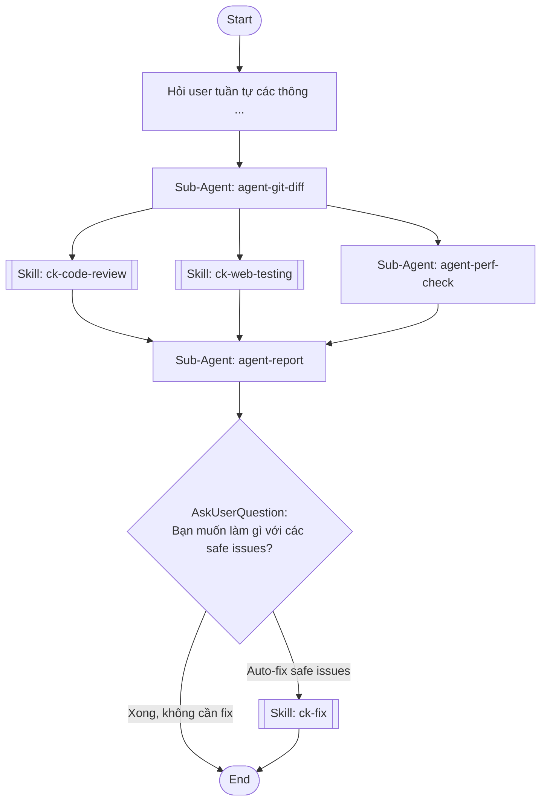

## Workflow Execution Guide

Follow the Mermaid flowchart above to execute the workflow. Each node type has specific execution methods as described below.

### Execution Methods by Node Type

- **Rectangle nodes (Sub-Agent: ...)**: Execute Sub-Agents
- **Diamond nodes (AskUserQuestion:...)**: Use the AskUserQuestion tool to prompt the user and branch based on their response
- **Diamond nodes (Branch/Switch:...)**: Automatically branch based on the results of previous processing (see details section)
- **Rectangle nodes (Prompt nodes)**: Execute the prompts described in the details section below

## Sub-Agent Node Details

#### agent-git-diff(Sub-Agent: agent-git-diff)

**Description**: Lấy git diff của branch hoặc commit cụ thể

**Model**: haiku

**Prompt**:

```
Lấy git diff để review code mới theo thứ tự ưu tiên:

**CÁCH A — Branch diff** (nếu user cung cấp branch name):
  `git diff main...[branch-name] -- "*.vue" "*.ts" "*.js"`
  Lấy commit list: `git log main...[branch-name] --oneline`

**CÁCH B — Commit range** (nếu user cung cấp commit ID bắt đầu):
  `git diff [from-commit]..HEAD -- "*.vue" "*.ts" "*.js"`
  Lấy commit list: `git log [from-commit]..HEAD --oneline`

**FALLBACK** (nếu không có gì):
  - Lấy current branch: `git branch --show-current`
  - Nếu không phải main: dùng Cách A với current branch
  - Nếu là main: hiển thị 10 commits gần nhất (`git log --oneline -10`) và yêu cầu user chọn from-commit

Sau khi xác định nguồn diff:
1. Lấy diff content
2. Lấy danh sách files thay đổi: `git diff --name-only [range]`
3. Lấy commit messages trong range

Output JSON:
{
  "review_mode": "branch | commit-range | fallback",
  "branch": "feat/staff-management hoặc null",
  "from_commit": "abc1234 hoặc null",
  "to_commit": "HEAD",
  "diff_content": "...",
  "changed_files": ["src/pages/app/Staff.vue"],
  "commits": ["abc1234 feat: add staff page", "def5678 fix: form validation"],
  "test_urls": [] hoặc ["http://localhost:8309/staff"],
  "test_steps": [] hoặc ["1. Vào /staff", "2. Click Thêm"],
  "has_fix_flag": true,
  "review_types": ["logic", "ui", "performance"]
}

review_types được lấy từ câu trả lời [1/4] của user:
- Chọn 1 → ["logic"]
- Chọn 2 → ["ui"]
- Chọn 3 → ["performance"]
- Chọn 4 hoặc không chọn → ["logic", "ui", "performance"]
- Có thể kết hợp, ví dụ chọn 1+2 → ["logic", "ui"]

LƯU Ý: KHÔNG tạo file - trả qua context
```

#### agent-perf-check(Sub-Agent: agent-perf-check)

**Description**: Kiểm tra bundle size và performance

**Model**: haiku

**Prompt**:

```
Nếu review_types KHÔNG chứa 'performance': trả {"skipped":true} và dừng.

Static từ diff: (1) packages mới >50KB, (2) import không tree-shake (lodash/moment toàn bộ), (3) ảnh thiếu loading=lazy, (4) computed/watch nặng không debounce, (5) API gọi lại mỗi mount không cache.

Lighthouse: thử kết nối test_urls[0] hoặc https://localhost:8309 (port mặc định của dự án). Nếu không được HỎI USER port. Vẫn không có server: lighthouse_skipped=true.
Nếu có server (kể cả HTTPS tự ký): chạy 2 lần với flag --ignore-certificate-errors để bypass SSL:
  (A) lighthouse <url> --chrome-flags="--headless --ignore-certificate-errors" --output=json --quiet
  (B) lighthouse <url> --chrome-flags="--headless --ignore-certificate-errors" --output=json --quiet --emulated-form-factor=mobile --throttling-method=simulate --throttling.cpuSlowdownMultiplier=4
Lấy FCP/LCP/TBT/CLS/TTI. Ngưỡng: LCP<2.5s tốt/>4s kém; TBT<200ms tốt/>600ms kém.
Nếu chậm: tìm resource block render, bundle >200KB.

Output JSON: {"static_analysis":{"heavy_packages":[],"bad_imports":[],"lazy_missing":[],"no_cache":[]},"lighthouse_normal":{"fcp":"","lcp":"","tbt":"","cls":0,"score":0},"lighthouse_low_end":{"fcp":"","lcp":"","tbt":"","cls":0,"score":0},"lighthouse_skipped":false,"bottlenecks":[],"low_end_impact":"","passed":true}
```

#### agent-report(Sub-Agent: agent-report)

**Description**: Tổng hợp kết quả và tạo report

**Model**: haiku

**Prompt**:

```
Tổng hợp code-review + visual-test + perf-check. LUÔN hiển thị đủ 3 section dù skipped.

Format:
## 📋 KẾT QUẢ REVIEW
**Branch/Range:** ... | **Files:** X | **Verdict:** 🔴BLOCK/🟡REVIEW/🟢PASS

### 🔴 CODE ISSUES (N vấn đề)
| # | File | Vấn đề | Loại | Giải pháp |
(⚪ SKIPPED nếu không chọn logic)

### 🖥️ UI/VISUAL TEST
| Trang | Desktop | Tablet | Mobile | Vấn đề |
| Element | Vấn đề | Severity | Giải pháp |
(⚪ SKIPPED / ⚠️ STATIC ONLY — liệt kê static_warnings)

### ⚡ PERFORMANCE (score bình thường / máy yếu)
| Metric | Bình thường | Máy yếu/3G | Đánh giá |
FCP<1.8s tốt, LCP<2.5s tốt, TBT<200ms tốt.
| Nguyên nhân | Impact | Giải pháp |
(⚪ SKIPPED / ⚠️ NO SERVER)

### 📝 PHƯƠNG ÁN GIẢI QUYẾT
Ưu tiên cao (fix trước merge): [vấn đề → bước cụ thể, file/hàm]
Ưu tiên trung bình: ...
Ưu tiên thấp: ...

### 💬 FEEDBACK GỬI DEV
[message copy-paste]

Verdict: BLOCK=critical; REVIEW=warnings; PASS=minor.
Nếu has_fix_flag=true: '💡 Có thể auto-fix X safe issues'
```

## Skill Nodes

#### skill-code-review(ck-code-review)

- **Prompt**: skill "ck-code-review" "## KIỂM TRA ĐIỀU KIỆN TRƯỚC
Nếu review_types trong context KHÔNG chứa 'logic':
→ Trả về ngay: {"skipped": true, "reason": "User không chọn review Logic", "issues": []}
→ DỪNG, không làm gì thêm.

---

Review code diff sau theo conventions của dự án này (CLAUDE.md):
- Naming: snake_case variables, camelCase functions, PascalCase components
- Vue 3: v-for :key, emit typing, prop validation
- TypeScript: tránh any, null checks
- DRY violations, YAGNI
- Phân loại issues: safe_to_fix (naming, lint) vs needs_dev (logic bugs)
- Output: issues list + feedback message sẵn sàng gửi DEV

Nếu test_steps có trong context → verify logic code có đúng với expected flow không

Diff content từ context:
{{diff_content}}"

#### skill-visual-test(ck-web-testing)

- **Prompt**: skill "ck-web-testing" "Nếu review_types KHÔNG chứa 'ui': trả {"status":"skipped","overall":"skipped"} và dừng.

Test UI trên Chrome với Playwright:
1. URLs: dùng test_urls nếu có; suy luận từ changed_files (Staff.vue→/staff, thử localhost:3000/5173); không được thì HỎI USER port.
2. Không có server: static analysis từ diff (z-index conflict, hardcoded sizes, overflow-hidden trên dropdown, missing responsive classes) → status='static_only'.
3. Có server: test 3 breakpoints (1440/768/375px) - chụp screenshot, tìm overflow/element chồng. Test: dropdown mở/đóng, button click, modal, form validation, tab. Kiểm tra text truncate, font fallback, tiếng Việt. Thực hiện test_steps nếu có.
4. Output JSON: {"status":"tested|static_only|skipped","pages_tested":[{"url":"","breakpoints":{"desktop":"pass|fail","tablet":"pass|fail","mobile":"pass|fail"},"issues":[]}],"interactive_issues":[],"static_warnings":[],"overall":"pass|fail|skipped","total_issues":0}"

#### skill-auto-fix(ck-fix)

- **Prompt**: skill "ck-fix" "Fix các safe issues từ code review report --quick:

CHỈ fix những issues được đánh dấu safe_to_fix:
- Naming convention violations (snake_case, camelCase)
- Missing v-for :key bindings
- Unused imports
- console.log/debugger thừa

TUYỆT ĐỐI KHÔNG fix:
- Logic bugs (không chắc intent của DEV)
- Component structure changes
- State management
- Bất kỳ thứ có thể thay đổi behavior

Sau khi fix: list files đã sửa, KHÔNG tự commit, hỏi user confirm"

### Prompt Node Details

#### prompt-branch-input(Hỏi user tuần tự các thông ...)

```
Hỏi user tuần tự các thông tin sau, hỏi từng câu một và chờ trả lời trước khi hỏi tiếp:

---

**[1/4 — BẮT BUỘC] Loại review muốn thực hiện:**

Chọn một hoặc nhiều:
- **1 — Logic code**: review naming, DRY, YAGNI, TypeScript types, Vue 3 patterns, potential bugs
- **2 — Giao diện UI**: test layout responsive (Desktop/Tablet/Mobile), dropdown, button, form, modal, text rendering
- **3 — Performance**: đo tốc độ tải trang, LCP/FCP/TBT, bundle size, bottlenecks trên máy yếu/mạng 3G
- **4 — Tất cả** (mặc định nếu không chọn)

---

**[2/4 — BẮT BUỘC] Phạm vi code cần review** — chọn 1 trong 2 cách:

- **Cách A — Branch diff**: Branch name cần review so với main, ví dụ: `feat/staff-management`
- **Cách B — Commit range**: Commit ID bắt đầu đến HEAD, ví dụ: `abc1234`
  (Nếu không nhớ: AI sẽ hiển thị 10 commits gần nhất để chọn)

Nếu không cung cấp gì: dùng current branch so với main.

---

**[3/4 — Hỏi nếu chọn UI hoặc Tất cả] Thông tin test giao diện:**

- **URL(s) cần test**: ví dụ `http://localhost:8309/staff`
  (Nếu không có: AI tự suy luận từ changed_files)
- **Các bước để đến giao diện đó**: ví dụ "1. Vào /staff → 2. Click Thêm nhân viên → 3. Điền form"
  (Nếu không có: AI tự suy luận từ code)

---

**[4/4 — BẮT BUỘC] Muốn AI auto-fix các safe issues không?** (có/không)
```

### AskUserQuestion Node Details

Ask the user and proceed based on their choice.

#### ask-fix-action(Bạn muốn làm gì với các safe issues?)

**Selection mode:** Single Select (branches based on the selected option)

**Options:**
- **Auto-fix safe issues**: AI sửa naming, missing :key, unused imports
- **Xong, không cần fix**: Chỉ lấy feedback để gửi DEV
