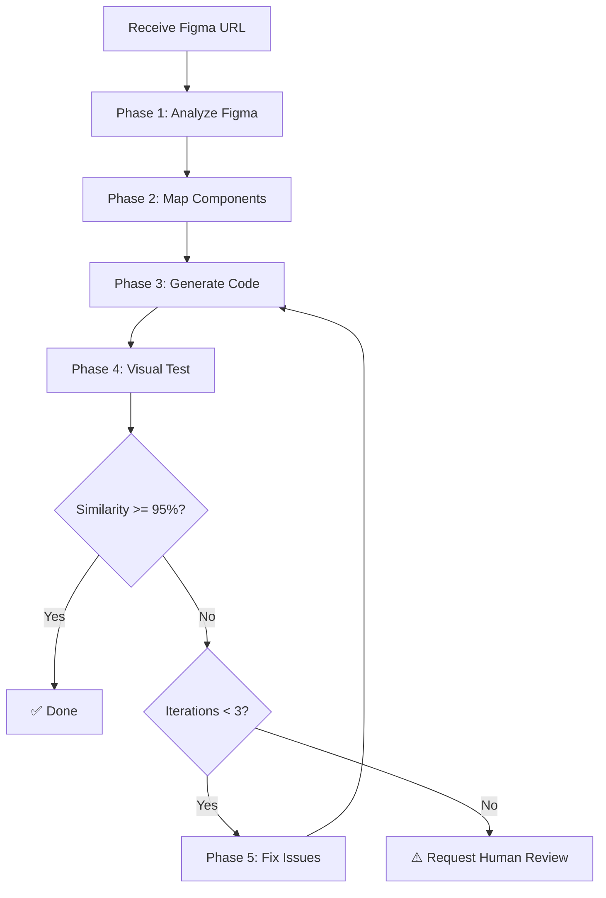

# Figma-to-Code Automation Workflow

> **Quy trình tự động chuyển đổi thiết kế Figma thành code Vue 3 + Tailwind CSS**

## 📋 Tổng quan

Workflow này tự động hóa việc chuyển đổi thiết kế Figma thành code Vue production-ready với độ chính xác cao (>95% visual similarity).

## 🎯 Mục tiêu

1. **Tự động phân tích** thiết kế Figma
2. **Tái sử dụng tối đa** components hiện có
3. **Đảm bảo độ chính xác** cao (>95% similarity)
4. **Tự động test** visual regression
5. **Tự động sửa lỗi** nếu không khớp thiết kế

## 🔄 Quy trình 5 bước

### ⚙️ PHASE 1: Figma Analysis

**Objective:** Hiểu rõ thiết kế từ Figma

**Input:** Figma URL (design hoặc board)

**Steps:**

1. **Extract Figma Information**
   ```bash
   # Parse URL to get fileKey and nodeId
   URL format: https://figma.com/design/:fileKey/:fileName?node-id=:nodeId
   ```

2. **Fetch Design Context**
   - Use `mcp__figma-remote-mcp__get_design_context`
   - Extract: components, styles, layout, variables
   - Get screenshot: `mcp__figma-remote-mcp__get_screenshot`

3. **Get Metadata**
   - Use `mcp__figma-remote-mcp__get_metadata`
   - Understand structure: frames, groups, layers
   - Identify node hierarchy

4. **Get Variable Definitions**
   - Use `mcp__figma-remote-mcp__get_variable_defs`
   - Extract: colors, typography, spacing
   - Map to design tokens

5. **Analyze Components**
   - Identify reusable patterns
   - Detect component variants
   - Extract props/states
   - Document component relationships

**Output:**
```typescript
{
  design_url: string
  file_key: string
  node_id: string
  screenshot_url: string
  components: Array<{
    name: string
    type: 'button' | 'input' | 'card' | 'layout' | 'custom'
    props: Record<string, any>
    styles: Record<string, string>
    children: Array<Component>
  }>
  design_tokens: {
    colors: Record<string, string>
    typography: Record<string, string>
    spacing: Record<string, string>
  }
  layout: {
    width: number
    height: number
    responsive: boolean
  }
}
```

---

### 🔍 PHASE 2: Component Mapping

**Objective:** Map Figma components to existing Vue components

**Steps:**

1. **Read Existing Components (MANDATORY)**
   ```bash
   # ✅ MANDATORY: ONLY scan and use custom components
   src/components/custom/**/*.vue
     - Button, Input, Checkbox, Icon, Switch
     - Tabs, Dropdown, Drawer, Toast, Tooltip
     - Already styled, full TypeScript support
     - 26 folders với 47 components

   # ❌ FORBIDDEN: DO NOT use ui components
   src/components/ui/**/*.vue
     - These are INTERNAL ONLY (for building custom components)
     - NEVER import in pages or features
     - BANNED from direct usage
   ```

   **CRITICAL:** ONLY use `@/components/custom/*` - NO EXCEPTIONS

2. **Analyze Component Capabilities**
   - Read component source code
   - Extract props interface
   - Identify variants/sizes/states
   - Document usage patterns

3. **Create Component Map**
   ```typescript
   {
     figma_component: string,
     vue_component: string,
     match_confidence: number,  // 0-100%
     props_mapping: Record<string, string>,
     requires_customization: boolean
   }
   ```

4. **Component Priority Matrix**

   **Step 1: Check Custom Components (MANDATORY)**
   ```
   Figma Button → @/components/custom/button ✅
   Figma Input  → @/components/custom/input  ✅
   Figma Icon   → @/components/custom/icon   ✅
   ```

   **Step 2: If not in custom → CREATE NEW in custom folder**
   ```
   Figma Dialog    → CREATE @/components/custom/dialog ✅
   Figma Accordion → CREATE @/components/custom/accordion ✅
   ```

   **❌ FORBIDDEN:** DO NOT use @/components/ui/* directly

   **Step 3: Decision Matrix**
   ```
   Match >= 90% → Use existing component as-is
   Match 70-89% → Use with minor customization
   Match 50-69% → Consider creating variant
   Match < 50%  → Create new component
   ```

   **Common Mappings:**
   ```
   Figma Button      → Button (custom) - 95% match
   Figma Text Input  → Input (custom) - 95% match
   Figma Checkbox    → Checkbox (custom) - 95% match
   Figma Toggle      → Switch (custom) - 95% match
   Figma Icon        → Icon (custom) - 100% match
   Figma Dropdown    → Dropdown (custom) - 90% match
   Figma Tab         → Tabs (custom) - 90% match
   ```

5. **Generate Component Mapping Report**
   - List all mappings
   - Highlight reusable components
   - Flag components needing creation

**Output:**
```typescript
{
  reusable_components: Array<{
    figma_name: string
    vue_path: string
    confidence: number
    customization: string[]
  }>,
  new_components_needed: Array<{
    name: string
    reason: string
    estimated_complexity: 'low' | 'medium' | 'high'
  }>
}
```

---

### 💻 PHASE 3: Code Implementation

**Objective:** Generate Vue 3 code with maximum component reuse

**Steps:**

1. **Setup File Structure**
   ```
   src/pages/[PageName].vue          # Main page component
   src/components/custom/[New]/      # New components (if needed)
   ```

2. **Generate Vue SFC**

   **Template:**
   ```vue
   <template>
     <div class="container">
       <!-- Use existing components -->
       <Button variant="primary" size="lg">
         Click me
       </Button>

       <!-- Compose complex layouts -->
       <div class="grid grid-cols-2 gap-4">
         <Card v-for="item in items" :key="item.id">
           <CardHeader>{{ item.title }}</CardHeader>
         </Card>
       </div>
     </div>
   </template>
   ```

   **Script:**
   ```vue
   <script setup lang="ts">
   import { ref, computed } from 'vue'
   import { Button } from '@/components/custom/button'
   import { Card, CardHeader } from '@/components/ui/card'

   // Type-safe props
   interface Props {
     data?: any[]
   }

   const props = withDefaults(defineProps<Props>(), {
     data: () => []
   })

   // Reactive state
   const items = ref(props.data)
   </script>
   ```

   **Styles:**
   ```vue
   <style scoped>
   .container {
     @apply mx-auto max-w-7xl px-4 py-8;
   }
   </style>
   ```

3. **Apply Tailwind Classes (🚨 INLINE ONLY)**

   **CRITICAL:** Tailwind CSS v4 `@apply` **KHÔNG HOẠT ĐỘNG** trong `<style scoped>`. PHẢI dùng inline classes.

   ```vue
   <!-- ✅ CORRECT - Inline Tailwind classes -->
   <template>
     <div class="flex items-center gap-4 p-6 bg-white rounded-2xl shadow-lg">
       <h1 class="text-2xl font-bold text-neutral-100">Title</h1>
     </div>
   </template>

   <!-- ❌ WRONG - @apply trong style scoped (KHÔNG HOẠT ĐỘNG) -->
   <style scoped>
   .container { @apply flex items-center; } /* ❌ BROKEN */
   </style>
   ```

   - Match Figma styles exactly:
     - Colors → Tailwind colors (`bg-primary`, `text-neutral-100`)
     - Typography → Tailwind text utilities (`text-2xl font-bold`)
     - Spacing → Tailwind spacing (`p-6 gap-4 mt-2`)
     - Layout → Flexbox/Grid utilities (`flex items-center`, `grid grid-cols-2`)

4. **Component Import Strategy (🚨 MANDATORY)**

   **✅ ONLY import from custom - NO EXCEPTIONS:**
   ```typescript
   // ✅ CORRECT: ONLY use custom components
   import { Button } from '@/components/custom/button'
   import { Input } from '@/components/custom/input'
   import { Checkbox } from '@/components/custom/checkbox'
   import { Icon } from '@/components/custom/icon'
   import { Switch } from '@/components/custom/switch'
   import { Tabs } from '@/components/custom/tabs'
   import { Dropdown } from '@/components/custom/dropdown'
   import { toast } from 'vue-sonner'  // For Toast notifications

   // If component doesn't exist in custom → CREATE NEW in custom folder
   import { CustomWidget } from '@/components/custom/custom-widget'
   ```

   **❌ FORBIDDEN - NEVER import from ui:**
   ```typescript
   // ❌ BANNED - These imports are FORBIDDEN
   import { Button } from '@/components/ui/button'     // ❌ BANNED
   import { Input } from '@/components/ui/input'       // ❌ BANNED
   import { Dialog } from '@/components/ui/dialog'     // ❌ BANNED
   import { ScrollArea } from '@/components/ui/scroll-area' // ❌ BANNED
   ```

   **Rule:** `src/components/ui/` is INTERNAL ONLY for building custom components. NEVER import directly.

5. **Handle Responsive Design**
   ```vue
   <div class="grid grid-cols-1 md:grid-cols-2 lg:grid-cols-3 gap-4">
     <!-- Responsive breakpoints: sm, md, lg, xl, 2xl -->
   </div>
   ```

6. **Add TypeScript Types**
   ```typescript
   interface ComponentProps {
     title: string
     items: Array<{ id: number; name: string }>
     onAction?: (id: number) => void
   }
   ```

7. **Implement Interactions**
   - Click handlers
   - Form submissions
   - Hover states
   - Animations (if in Figma)

**Output:**
- Generated Vue file(s)
- Import statements
- Type definitions
- Tailwind classes applied

---

### 🧪 PHASE 4: E2E + Visual Testing

**Objective:** Test cả logic và visual để verify code hoàn toàn khớp Figma design

**Approach:** Sử dụng Playwright E2E testing framework với visual regression testing

**Steps:**

#### 1. Generate E2E Test File

Tạo test file tự động trong `e2e/tests/` sử dụng Figma Test Helper:

```typescript
// e2e/tests/[component-name].spec.ts
import { test, expect } from '@playwright/test'
import { createFigmaTest } from '../utils/figma-test-helper'

const FIGMA_CONFIG = {
  figma_url: '[Figma URL]',
  figma_screenshot_url: '[Screenshot URL from Phase 1]',
  page_route: '/[route]',
  test_name: '[component-name]'
}

test.describe('[Component] - E2E + Visual Testing', () => {
  test.beforeEach(async ({ page }) => {
    await page.goto(FIGMA_CONFIG.page_route, { waitUntil: 'networkidle' })
  })

  test('✅ Complete: Logic + Visual', async ({ page }) => {
    const helper = createFigmaTest(page, FIGMA_CONFIG)

    const result = await helper.runFigmaTest({
      logic_tests: [
        // Auto-generated logic tests
      ],
      visual_options: {
        threshold: 0.05,
        full_page: true
      }
    })

    expect(result.logic_passed).toBe(true)
    expect(result.visual_result?.passed).toBe(true)
  })
})
```

#### 2. Auto-generate Logic Tests

Based on Figma components từ Phase 2, generate logic tests:

```typescript
const logic_tests = [
  // Test 1: Component visibility & interactions
  async () => {
    await helper.testComponents([
      {
        selector: 'button.primary',
        name: 'Primary Button',
        tests: {
          visible: true,
          enabled: true,
          clickable: true,
          has_hover_state: true
        }
      },
      {
        selector: 'input[type="email"]',
        name: 'Email Input',
        tests: {
          visible: true,
          enabled: true
        }
      }
      // ... more components
    ])
  },

  // Test 2: Form functionality (if applicable)
  async () => {
    await helper.testForm({
      inputs: [
        { selector: 'input[type="email"]', value: 'test@example.com' },
        { selector: 'input[type="password"]', value: 'password123' }
      ],
      submit_button: 'button[type="submit"]'
    })
  },

  // Test 3: Navigation (if applicable)
  async () => {
    await helper.testNavigation([
      { selector: 'a.nav-link' }
    ])
  },

  // Test 4: Responsive design
  async () => {
    await helper.testResponsive([
      { width: 1920, height: 1080, name: 'Desktop' },
      { width: 768, height: 1024, name: 'Tablet' },
      { width: 375, height: 667, name: 'Mobile' }
    ])
  },

  // Test 5: Accessibility
  async () => {
    await helper.testAccessibility()
  },

  // Test 6: No console errors
  async () => {
    const errors: string[] = []
    page.on('pageerror', err => errors.push(err.message))

    // Interact with page
    await page.locator('button').first().click()
    await page.waitForTimeout(1000)

    expect(errors.length).toBe(0)
  }
]
```

#### 3. Run E2E Test Suite

```bash
# Auto-run dev server + Playwright tests
npx playwright test e2e/tests/[component-name].spec.ts

# With UI mode for debugging
npx playwright test --ui

# Generate HTML report
npx playwright test --reporter=html
```

#### 4. Visual Comparison Workflow

```typescript
// Tự động trong helper.runFigmaTest()

// 4a. Setup Figma baseline
const baseline_path = await helper.setupBaseline()
// Downloads Figma screenshot to e2e/screenshots/baselines/

// 4b. Capture current screenshot
await captureScreenshot(page, current_screenshot_path, {
  full_page: true,
  mask_selectors: ['.loading-spinner'] // Mask dynamic elements
})

// 4c. Compare screenshots
const result = await compareScreenshots(
  baseline_path,
  current_screenshot_path,
  diff_output_path,
  { threshold: 0.05 }
)

// 4d. Calculate similarity score
const similarity = result.similarity_score // percentage
const passed = similarity >= 95
```

#### 5. Generate Comprehensive Test Report

```typescript
const report = {
  test_name: '[component-name]',
  timestamp: new Date().toISOString(),

  // Logic testing results
  logic: {
    passed: true,
    tests_run: 6,
    tests_passed: 6,
    tests_failed: 0
  },

  // Visual testing results
  visual: {
    passed: true,
    similarity_score: 97.8,
    threshold: 95.0,
    diff_pixels: 2341,
    total_pixels: 1920 * 1080,
    diff_image: 'e2e/screenshots/diff/component-diff.png'
  },

  // Performance metrics
  performance: {
    fcp: 1250, // ms
    lcp: 2100, // ms
    cls: 0.02
  },

  // Accessibility
  accessibility: {
    missing_alt_texts: 0,
    missing_labels: 0,
    issues: []
  },

  // Overall status
  status: 'PASSED',
  summary: 'All tests passed. Visual similarity: 97.8%'
}

// Save report
fs.writeFileSync(
  `e2e/reports/${component_name}-report.md`,
  generateMarkdownReport(report)
)
```

#### 6. Automated Test Artifacts

Tests automatically generate:

```
e2e/
├── screenshots/
│   ├── baselines/
│   │   └── component-figma.png        # Figma design (baseline)
│   ├── current/
│   │   └── component.png               # Generated code screenshot
│   └── diff/
│       └── component-diff.png          # Highlighted differences
├── reports/
│   ├── html/
│   │   └── index.html                  # Playwright HTML report
│   ├── component-report.md             # Test report markdown
│   └── test-results.json               # JSON results
└── videos/ (if tests fail)
    └── component-chromium.webm
```

**Output:**
```typescript
{
  // Logic testing
  logic_passed: boolean
  logic_tests: {
    total: number
    passed: number
    failed: number
    duration_ms: number
  }

  // Visual testing
  visual_result: {
    passed: boolean
    similarity_score: number  // 0-100%
    threshold: 95
    diff_pixels: number
    total_pixels: number
    diff_image_path: string
  }

  // Combined status
  overall_passed: boolean  // logic AND visual must pass

  // Reports
  report_path: string
  screenshots: {
    baseline: string
    current: string
    diff: string
  }
}
```

**Pass Criteria:**
```
✅ Logic tests: 100% pass rate
✅ Visual similarity: >= 95%
✅ No console errors
✅ Responsive: All breakpoints work
✅ Accessibility: No critical issues
✅ Performance: FCP < 2s, LCP < 4s
```

**Failure Scenarios:**
```
❌ Logic test failed → Fix code, re-run Phase 3
❌ Visual < 95% → Proceed to Phase 5 (Iteration)
❌ Console errors → Debug and fix issues
❌ Responsive breaks → Adjust Tailwind classes
❌ Performance issues → Optimize assets/code
```

---

### 🔁 PHASE 5: Iteration & Refinement (AUTO-LOOP UNTIL PASS)

**Objective:** Achieve 100% logic pass + 95%+ visual similarity

**🚨 CRITICAL:** This phase CANNOT be skipped. Must loop until pass criteria met.

**Pass Criteria:**
```typescript
const PASS_CRITERIA = {
  logic_tests: 100,        // 100% pass rate (MANDATORY)
  visual_similarity: 95,   // >= 95% similarity (MANDATORY)
  max_iterations: 3        // Maximum attempts before human review
}
```

**Decision Tree:**

```
Start Iteration Loop
  ↓
Check Pass Criteria:
  ├─ Logic Tests Pass? (100%)
  │   ├─ NO → Fix code → Go to Phase 3
  │   └─ YES → Continue
  │
  ├─ Visual Similarity >= 95%?
  │   ├─ NO → Analyze & Fix → Go to Phase 4
  │   └─ YES → Continue
  │
  ├─ Both Pass?
  │   ├─ YES → ✅ DONE
  │   └─ NO → Continue iteration
  │
  └─ Iterations > MAX?
      ├─ YES → ⚠️ STOP & Request Human Review
      └─ NO → Continue Loop
```

**Automated Loop Logic:**

```typescript
async function autoIterateUntilPass() {
  let iteration = 0
  const MAX_ITERATIONS = 3

  while (iteration < MAX_ITERATIONS) {
    iteration++
    console.log(`🔄 Iteration ${iteration}/${MAX_ITERATIONS}`)

    // Phase 4: Run E2E + Visual Testing
    const test_result = await runE2EAndVisualTests()

    // Check logic tests
    if (!test_result.logic_passed) {
      console.log('❌ Logic tests failed')
      await fixLogicIssues(test_result.logic_errors)
      continue  // Back to Phase 3 → Phase 4
    }

    // Check visual similarity
    if (test_result.visual_similarity < 95) {
      console.log(`❌ Visual similarity: ${test_result.visual_similarity}%`)
      await fixVisualIssues(test_result.visual_diff)
      continue  // Back to Phase 3 → Phase 4
    }

    // Both pass!
    console.log('✅ All tests passed!')
    return {
      status: 'success',
      iterations: iteration,
      final_similarity: test_result.visual_similarity
    }
  }

  // Max iterations reached
  console.log('⚠️ Max iterations reached. Human review required.')
  return {
    status: 'needs_review',
    iterations: iteration,
    reason: 'Max iterations exceeded'
  }
}
```

**Steps:**

#### 1. Check Test Results

```typescript
// Từ Phase 4
const test_result = {
  logic: {
    passed: boolean,
    total: number,
    failed: number,
    errors: Array<{
      test: string,
      error: string,
      selector: string
    }>
  },
  visual: {
    similarity: number,
    passed: boolean,
    diff_pixels: number,
    issues: Array<{
      type: 'color' | 'spacing' | 'typography' | 'layout',
      element: string,
      expected: string,
      actual: string
    }>
  }
}
```

#### 2. Fix Logic Issues (if failed)

**Priority:** Fix logic before visual

```typescript
async function fixLogicIssues(errors) {
  for (const error of errors) {
    switch (error.type) {
      case 'element_not_found':
        // Add missing element
        await addElement(error.selector, error.expected_props)
        break

      case 'interaction_failed':
        // Fix event handlers
        await fixEventHandler(error.selector, error.event)
        break

      case 'validation_failed':
        // Fix validation logic
        await fixValidation(error.field, error.rule)
        break

      case 'console_error':
        // Debug and fix JavaScript errors
        await debugConsoleError(error.message)
        break
    }
  }

  // Save changes
  await saveFile(component_file)

  // Re-run Phase 4
  console.log('🔄 Re-running tests after logic fixes...')
}
```

#### 3. Fix Visual Issues (if similarity < 95%)

```typescript
async function fixVisualIssues(issues) {
  for (const issue of issues) {
    switch (issue.type) {
      case 'color':
        // Fix color mismatch
        await updateColor(issue.element, issue.expected)
        // Example: bg-primary-500 → bg-primary-600
        break

      case 'spacing':
        // Fix padding/margin
        await updateSpacing(issue.element, issue.expected)
        // Example: px-4 → px-6, mt-2 → mt-4
        break

      case 'typography':
        // Fix font properties
        await updateTypography(issue.element, issue.expected)
        // Example: text-base → text-lg, font-medium → font-semibold
        break

      case 'layout':
        // Fix layout properties
        await updateLayout(issue.element, issue.expected)
        // Example: flex-row → flex-col, gap-2 → gap-4
        break

      case 'size':
        // Fix width/height
        await updateSize(issue.element, issue.expected)
        // Example: w-32 → w-40, h-10 → h-12
        break
    }
  }

  // Save changes
  await saveFile(component_file)

  // Re-run Phase 4
  console.log('🔄 Re-running tests after visual fixes...')
}
```

#### 4. Iteration Tracking

```typescript
const iteration_report = {
  iteration: number,
  timestamp: string,

  before: {
    logic_pass_rate: number,
    visual_similarity: number
  },

  fixes_applied: Array<{
    type: string,
    description: string,
    file: string,
    line: number
  }>,

  after: {
    logic_pass_rate: number,
    visual_similarity: number
  },

  improvement: {
    logic: number,      // percentage improvement
    visual: number      // percentage improvement
  }
}
```

#### 5. Stop Conditions

**✅ Success (Exit Loop):**
```typescript
if (logic_passed && visual_similarity >= 95) {
  return { status: 'success' }
}
```

**⚠️ Max Iterations (Stop & Request Review):**
```typescript
if (iteration > MAX_ITERATIONS) {
  return {
    status: 'needs_review',
    reason: 'Max iterations exceeded',
    last_result: {
      logic_passed,
      visual_similarity
    },
    suggestions: generateHumanReviewSuggestions()
  }
}
```

6. **Generate Final Report**
   ```markdown
   ## Visual Testing Report

   - **Final Similarity:** 97.8%
   - **Status:** ✅ Passed
   - **Iterations:** 2
   - **Time:** 4 minutes

   ### Changes Made:
   1. Adjusted button padding from `px-4` to `px-6`
   2. Fixed primary color from `#269a86` to `#269a85`
   3. Updated font-weight from `500` to `600`

   ### Files Modified:
   - `src/pages/Login.vue`
   - `src/components/custom/button/Button.vue`
   ```

**Output:**
```typescript
{
  status: 'completed' | 'needs_review',
  final_similarity: number,
  iterations_count: number,
  changes_made: string[],
  files_modified: string[],
  time_elapsed: string
}
```

---

## 🛡️ Workflow Enforcement & Validation

**🚨 CRITICAL RULES - CANNOT BE SKIPPED:**

### Rule 1: E2E Testing is MANDATORY

```typescript
// ❌ FORBIDDEN - Skip testing
if (skip_visual_test) {
  throw new Error('E2E testing CANNOT be skipped')
}

// ✅ REQUIRED - Must run tests
await runE2EAndVisualTests()  // MANDATORY
```

### Rule 2: Must Pass BOTH Logic AND Visual

```typescript
const pass_criteria = {
  logic_tests: {
    pass_rate: 100,           // Must be 100%
    required: true            // MANDATORY
  },
  visual_similarity: {
    minimum: 95,              // Must be >= 95%
    required: true            // MANDATORY
  }
}

// ❌ Cannot proceed if either fails
if (!logic_passed || visual_similarity < 95) {
  // MUST iterate (Phase 5)
  await autoIterateUntilPass()
}
```

### Rule 3: Auto-Loop Until Pass (Max 3 iterations)

```typescript
let iteration = 0
const MAX_ITERATIONS = 3

while (!allTestsPass() && iteration < MAX_ITERATIONS) {
  iteration++

  // Fix issues
  await fixIssues()

  // Re-test
  await runTests()
}

// If still not pass after 3 iterations
if (!allTestsPass()) {
  throw new Error('⚠️ STOP: Human review required')
}
```

### Validation Checkpoints

**Checkpoint 1: After Phase 3 (Code Generation)**
```typescript
✅ Check: Files created?
✅ Check: Imports correct (from @/components/custom)?
✅ Check: TypeScript compiles?
✅ Check: No syntax errors?

if (any_fail) {
  → Back to Phase 3
}
```

**Checkpoint 2: After Phase 4 (E2E Testing)**
```typescript
✅ Check: Tests executed?
✅ Check: Logic tests passed 100%?
✅ Check: Visual similarity >= 95%?

if (any_fail) {
  → Phase 5 (Iteration)
}
```

**Checkpoint 3: After Phase 5 (Iteration)**
```typescript
✅ Check: Issues fixed?
✅ Check: Re-tests passed?
✅ Check: Iterations < MAX?

if (all_pass) {
  → ✅ DONE
else if (iterations >= MAX) {
  → ⚠️ STOP (Human Review)
else
  → Back to Phase 4
}
```

### Error Handling Matrix

| Error Type | Action | Go To |
|------------|--------|-------|
| Syntax Error | Fix code | Phase 3 |
| Import Error | Fix imports | Phase 3 |
| TypeScript Error | Fix types | Phase 3 |
| Logic Test Fail | Fix logic | Phase 3 → Phase 4 |
| Visual < 95% | Fix styling | Phase 3 → Phase 4 |
| Max Iterations | Stop & Report | Human Review |

### Forbidden Actions

**❌ NEVER DO:**
1. Skip E2E testing
2. Skip visual testing
3. Proceed when logic tests fail
4. Proceed when visual < 95%
5. Skip iteration when tests fail
6. Continue beyond MAX_ITERATIONS

**✅ ALWAYS DO:**
1. Run E2E testing
2. Run visual testing
3. Check pass criteria
4. Iterate if not pass
5. Stop at MAX_ITERATIONS
6. Generate detailed reports

---

## 🚀 Complete Workflow Execution

### Activation Command
```bash
/design:figma https://figma.com/design/abc123/MyDesign?node-id=1-2
```

### Automated Flow


### Expected Timeline
- **Phase 1:** 1-2 minutes (Figma analysis)
- **Phase 2:** 1-2 minutes (Component mapping)
- **Phase 3:** 2-3 minutes (Code generation)
- **Phase 4:** 1 minute (Visual testing)
- **Phase 5:** 1-2 minutes per iteration

**Total:** ~5-10 minutes for automatic conversion

---

## 📝 Rules & Constraints

### MANDATORY Rules

1. ✅ **Always use existing components** if similarity >= 70%
2. ✅ **Maximum 3 iterations** before human review
3. ✅ **Minimum 95% visual similarity** to pass
4. ✅ **TypeScript strict mode** for all code
5. ✅ **Composition API** (`<script setup>`) only
6. ✅ **Tailwind CSS** for all styling (no inline styles)
7. ✅ **Follow naming conventions** (snake_case for variables, camelCase for functions)

### FORBIDDEN Actions

1. ❌ **Do NOT** create new components without checking existing ones first
2. ❌ **Do NOT** use inline styles (use Tailwind classes)
3. ❌ **Do NOT** skip visual testing
4. ❌ **Do NOT** proceed if similarity < 95% (iterate or request review)
5. ❌ **Do NOT** use Options API (only Composition API)
6. ❌ **🚨 BANNED** import from `@/components/ui/*` - ONLY use `@/components/custom/*`
7. ❌ **🚨 BANNED** `@apply` trong `<style scoped>` - Tailwind v4 không hỗ trợ, dùng inline classes

---

## 🛠️ Tools & Technologies

### Figma MCP Tools
- `mcp__figma-remote-mcp__get_design_context` - Get code + assets
- `mcp__figma-remote-mcp__get_screenshot` - Capture design screenshot
- `mcp__figma-remote-mcp__get_metadata` - Get structure/hierarchy
- `mcp__figma-remote-mcp__get_variable_defs` - Get design tokens

### Testing Tools
- **Playwright** - E2E testing & screenshots
- **Pixelmatch** - Image comparison
- **Sharp** - Image processing

### Development Tools
- **Vite** - Dev server (https://localhost:8309)
- **Vue Devtools** - Component inspection
- **Tailwind IntelliSense** - CSS class suggestions

---

## 📊 Success Metrics

### Quality Metrics
- ✅ Visual similarity: >= 95%
- ✅ Component reuse rate: >= 80%
- ✅ TypeScript coverage: 100%
- ✅ Zero inline styles
- ✅ Responsive design: All breakpoints

### Performance Metrics
- ⏱️ Total time: < 10 minutes
- ⏱️ Iterations: <= 3
- 🎯 First-pass success rate: >= 60%

---

## 🔗 Related Workflows

- [development-rules.md](./development-rules.md) - Coding standards
- [component-analysis.md](./component-analysis.md) - Component library guide
- [visual-testing.md](./visual-testing.md) - Testing protocols

---

## 📖 Example Usage

### Example 1: Login Page
```bash
# Input
/design:figma https://figma.com/design/abc/Login?node-id=1-2

# Output
✅ Generated: src/pages/Login.vue
✅ Similarity: 97.8%
✅ Components used: Button, Input, Checkbox
✅ Time: 6 minutes
```

### Example 2: Dashboard
```bash
# Input
/design:figma https://figma.com/design/xyz/Dashboard?node-id=10-50

# Output
✅ Generated: src/pages/Dashboard.vue
✅ New component: src/components/custom/stats-card/StatsCard.vue
✅ Similarity: 96.2%
✅ Iterations: 2
✅ Time: 9 minutes
```

---

**Last Updated:** 2026-01-30
**Version:** 1.0.0
