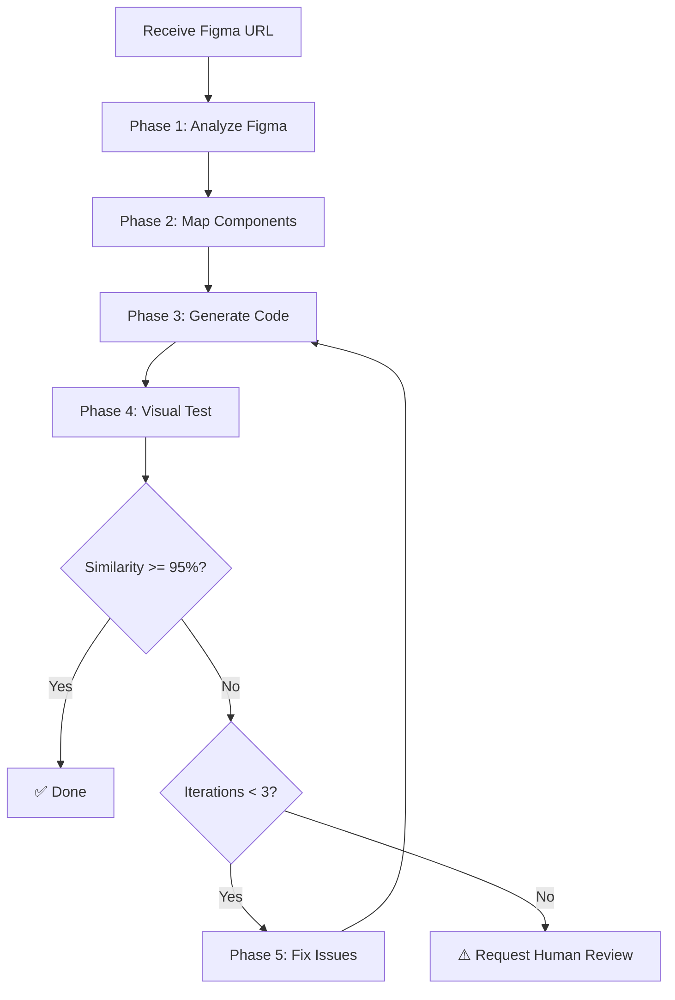

# Figma-to-Code Automation Workflow

> **Quy trình tự động chuyển đổi thiết kế Figma thành code Vue 3 + Tailwind CSS**

## 📋 Tổng quan

Workflow này tự động hóa việc chuyển đổi thiết kế Figma thành code Vue production-ready với độ chính xác cao (>95% visual similarity).

## 🎯 Mục tiêu

1. **Tự động phân tích** thiết kế Figma
2. **Tái sử dụng tối đa** components hiện có
3. **Đảm bảo độ chính xác** cao (>95% similarity)
4. **Tự động test** visual regression
5. **Tự động sửa lỗi** nếu không khớp thiết kế

## 🔄 Quy trình 5 bước

### ⚙️ PHASE 1: Figma Analysis

**Objective:** Hiểu rõ thiết kế từ Figma

**Input:** Figma URL (design hoặc board)

**Steps:**

1. **Extract Figma Information**
   ```bash
   # Parse URL to get fileKey and nodeId
   URL format: https://figma.com/design/:fileKey/:fileName?node-id=:nodeId
   ```

2. **Fetch Design Context**
   - Use `mcp__figma-remote-mcp__get_design_context`
   - Extract: components, styles, layout, variables
   - Get screenshot: `mcp__figma-remote-mcp__get_screenshot`

3. **Get Metadata**
   - Use `mcp__figma-remote-mcp__get_metadata`
   - Understand structure: frames, groups, layers
   - Identify node hierarchy

4. **Get Variable Definitions**
   - Use `mcp__figma-remote-mcp__get_variable_defs`
   - Extract: colors, typography, spacing
   - Map to design tokens

5. **Analyze Components**
   - Identify reusable patterns
   - Detect component variants
   - Extract props/states
   - Document component relationships

**Output:**
```typescript
{
  design_url: string
  file_key: string
  node_id: string
  screenshot_url: string
  components: Array<{
    name: string
    type: 'button' | 'input' | 'card' | 'layout' | 'custom'
    props: Record<string, any>
    styles: Record<string, string>
    children: Array<Component>
  }>
  design_tokens: {
    colors: Record<string, string>
    typography: Record<string, string>
    spacing: Record<string, string>
  }
  layout: {
    width: number
    height: number
    responsive: boolean
  }
}
```

---

### 🔍 PHASE 2: Component Mapping

**Objective:** Map Figma components to existing Vue components

**Steps:**

1. **Read Existing Components**
   ```bash
   # Scan component directories
   src/components/ui/**/*.vue       # Shadcn primitives
   src/components/custom/**/*.vue   # Custom components
   ```

2. **Analyze Component Capabilities**
   - Read component source code
   - Extract props interface
   - Identify variants/sizes/states
   - Document usage patterns

3. **Create Component Map**
   ```typescript
   {
     figma_component: string,
     vue_component: string,
     match_confidence: number,  // 0-100%
     props_mapping: Record<string, string>,
     requires_customization: boolean
   }
   ```

4. **Decision Matrix**
   ```
   Match >= 90% → Use existing component as-is
   Match 70-89% → Use with minor customization
   Match 50-69% → Consider creating variant
   Match < 50%  → Create new component
   ```

5. **Generate Component Mapping Report**
   - List all mappings
   - Highlight reusable components
   - Flag components needing creation

**Output:**
```typescript
{
  reusable_components: Array<{
    figma_name: string
    vue_path: string
    confidence: number
    customization: string[]
  }>,
  new_components_needed: Array<{
    name: string
    reason: string
    estimated_complexity: 'low' | 'medium' | 'high'
  }>
}
```

---

### 💻 PHASE 3: Code Implementation

**Objective:** Generate Vue 3 code with maximum component reuse

**Steps:**

1. **Setup File Structure**
   ```
   src/pages/[PageName].vue          # Main page component
   src/components/custom/[New]/      # New components (if needed)
   ```

2. **Generate Vue SFC**

   **Template:**
   ```vue
   <template>
     <div class="container">
       <!-- Use existing components -->
       <Button variant="primary" size="lg">
         Click me
       </Button>

       <!-- Compose complex layouts -->
       <div class="grid grid-cols-2 gap-4">
         <Card v-for="item in items" :key="item.id">
           <CardHeader>{{ item.title }}</CardHeader>
         </Card>
       </div>
     </div>
   </template>
   ```

   **Script:**
   ```vue
   <script setup lang="ts">
   import { ref, computed } from 'vue'
   import { Button } from '@/components/custom/button'
   import { Card, CardHeader } from '@/components/ui/card'

   // Type-safe props
   interface Props {
     data?: any[]
   }

   const props = withDefaults(defineProps<Props>(), {
     data: () => []
   })

   // Reactive state
   const items = ref(props.data)
   </script>
   ```

   **Styles:**
   ```vue
   <style scoped>
   .container {
     @apply mx-auto max-w-7xl px-4 py-8;
   }
   </style>
   ```

3. **Apply Tailwind Classes**
   - Use design tokens from Phase 1
   - Match Figma styles exactly:
     - Colors → CSS variables or Tailwind colors
     - Typography → Tailwind text utilities
     - Spacing → Tailwind spacing scale
     - Layout → Flexbox/Grid utilities

4. **Component Import Strategy**
   ```typescript
   // Priority 1: Use existing UI components
   import { Button } from '@/components/custom/button'
   import { Input } from '@/components/custom/input'

   // Priority 2: Use Shadcn primitives
   import { Dialog } from '@/components/ui/dialog'

   // Priority 3: Create new (only if necessary)
   import { CustomWidget } from '@/components/custom/custom-widget'
   ```

5. **Handle Responsive Design**
   ```vue
   <div class="grid grid-cols-1 md:grid-cols-2 lg:grid-cols-3 gap-4">
     <!-- Responsive breakpoints: sm, md, lg, xl, 2xl -->
   </div>
   ```

6. **Add TypeScript Types**
   ```typescript
   interface ComponentProps {
     title: string
     items: Array<{ id: number; name: string }>
     onAction?: (id: number) => void
   }
   ```

7. **Implement Interactions**
   - Click handlers
   - Form submissions
   - Hover states
   - Animations (if in Figma)

**Output:**
- Generated Vue file(s)
- Import statements
- Type definitions
- Tailwind classes applied

---

### 🧪 PHASE 4: Visual Testing

**Objective:** Verify code matches Figma design exactly

**Steps:**

1. **Start Development Server**
   ```bash
   npm run dev
   # Server runs on https://localhost:8309
   ```

2. **Setup Playwright Test**
   ```typescript
   import { test, expect } from '@playwright/test'

   test('visual regression - [Component Name]', async ({ page }) => {
     // Navigate to component
     await page.goto('https://localhost:8309/path-to-component')

     // Wait for rendering
     await page.waitForLoadState('networkidle')

     // Take screenshot
     const screenshot = await page.screenshot({
       fullPage: true,
       animations: 'disabled'
     })

     // Compare with Figma screenshot
     expect(screenshot).toMatchSnapshot('figma-design.png', {
       threshold: 0.05  // 95% similarity
     })
   })
   ```

3. **Capture Screenshots**
   - Generated code output
   - Figma design reference
   - Save both for comparison

4. **Visual Comparison**
   ```typescript
   import pixelmatch from 'pixelmatch'
   import { PNG } from 'pngjs'

   function compareImages(img1: Buffer, img2: Buffer): number {
     const png1 = PNG.sync.read(img1)
     const png2 = PNG.sync.read(img2)

     const { width, height } = png1
     const diff = new PNG({ width, height })

     const mismatch = pixelmatch(
       png1.data,
       png2.data,
       diff.data,
       width,
       height,
       { threshold: 0.1 }
     )

     const similarity = ((width * height - mismatch) / (width * height)) * 100
     return similarity
   }
   ```

5. **Generate Test Report**
   ```typescript
   {
     similarity_score: 97.5,  // percentage
     passed: true,            // >= 95%
     differences: [
       {
         element: '.button',
         issue: 'Color mismatch',
         expected: '#269a85',
         actual: '#269a86'
       }
     ],
     screenshot_diff: 'path/to/diff.png'
   }
   ```

**Output:**
```typescript
{
  test_passed: boolean
  similarity_score: number
  issues: Array<{
    location: string
    description: string
    fix_suggestion: string
  }>
  screenshots: {
    figma: string
    generated: string
    diff: string
  }
}
```

---

### 🔁 PHASE 5: Iteration & Refinement

**Objective:** Achieve 95%+ visual similarity

**Decision Tree:**

```
similarity >= 95%
  ├─ YES → ✅ DONE
  └─ NO  → Continue iteration
```

**Steps:**

1. **Analyze Differences**
   - Parse test report from Phase 4
   - Identify specific mismatches:
     - Color variations
     - Spacing issues
     - Typography differences
     - Layout shifts
     - Missing elements

2. **Generate Fix Strategy**
   ```typescript
   issues.forEach(issue => {
     switch (issue.type) {
       case 'color':
         // Update CSS variable or Tailwind class
         break
       case 'spacing':
         // Adjust padding/margin
         break
       case 'typography':
         // Update font-size/weight/family
         break
       case 'layout':
         // Fix flexbox/grid properties
         break
     }
   })
   ```

3. **Apply Fixes**
   - Edit Vue component
   - Update Tailwind classes
   - Adjust CSS variables
   - Modify component props

4. **Re-run Visual Test**
   - Repeat Phase 4
   - Compare new similarity score
   - Check if issues resolved

5. **Iteration Limit**
   ```typescript
   const MAX_ITERATIONS = 3

   if (iteration_count > MAX_ITERATIONS) {
     // Request human review
     console.log('⚠️ Manual review needed')
     generateHumanReviewReport()
   }
   ```

6. **Generate Final Report**
   ```markdown
   ## Visual Testing Report

   - **Final Similarity:** 97.8%
   - **Status:** ✅ Passed
   - **Iterations:** 2
   - **Time:** 4 minutes

   ### Changes Made:
   1. Adjusted button padding from `px-4` to `px-6`
   2. Fixed primary color from `#269a86` to `#269a85`
   3. Updated font-weight from `500` to `600`

   ### Files Modified:
   - `src/pages/Login.vue`
   - `src/components/custom/button/Button.vue`
   ```

**Output:**
```typescript
{
  status: 'completed' | 'needs_review',
  final_similarity: number,
  iterations_count: number,
  changes_made: string[],
  files_modified: string[],
  time_elapsed: string
}
```

---

## 🚀 Complete Workflow Execution

### Activation Command
```bash
/design:figma https://figma.com/design/abc123/MyDesign?node-id=1-2
```

### Automated Flow


### Expected Timeline
- **Phase 1:** 1-2 minutes (Figma analysis)
- **Phase 2:** 1-2 minutes (Component mapping)
- **Phase 3:** 2-3 minutes (Code generation)
- **Phase 4:** 1 minute (Visual testing)
- **Phase 5:** 1-2 minutes per iteration

**Total:** ~5-10 minutes for automatic conversion

---

## 📝 Rules & Constraints

### MANDATORY Rules

1. ✅ **Always use existing components** if similarity >= 70%
2. ✅ **Maximum 3 iterations** before human review
3. ✅ **Minimum 95% visual similarity** to pass
4. ✅ **TypeScript strict mode** for all code
5. ✅ **Composition API** (`<script setup>`) only
6. ✅ **Tailwind CSS** for all styling (no inline styles)
7. ✅ **Follow naming conventions** (snake_case for variables, camelCase for functions)

### FORBIDDEN Actions

1. ❌ **Do NOT** create new components without checking existing ones first
2. ❌ **Do NOT** use inline styles (use Tailwind classes)
3. ❌ **Do NOT** skip visual testing
4. ❌ **Do NOT** proceed if similarity < 95% (iterate or request review)
5. ❌ **Do NOT** use Options API (only Composition API)

---

## 🛠️ Tools & Technologies

### Figma MCP Tools
- `mcp__figma-remote-mcp__get_design_context` - Get code + assets
- `mcp__figma-remote-mcp__get_screenshot` - Capture design screenshot
- `mcp__figma-remote-mcp__get_metadata` - Get structure/hierarchy
- `mcp__figma-remote-mcp__get_variable_defs` - Get design tokens

### Testing Tools
- **Playwright** - E2E testing & screenshots
- **Pixelmatch** - Image comparison
- **Sharp** - Image processing

### Development Tools
- **Vite** - Dev server (https://localhost:8309)
- **Vue Devtools** - Component inspection
- **Tailwind IntelliSense** - CSS class suggestions

---

## 📊 Success Metrics

### Quality Metrics
- ✅ Visual similarity: >= 95%
- ✅ Component reuse rate: >= 80%
- ✅ TypeScript coverage: 100%
- ✅ Zero inline styles
- ✅ Responsive design: All breakpoints

### Performance Metrics
- ⏱️ Total time: < 10 minutes
- ⏱️ Iterations: <= 3
- 🎯 First-pass success rate: >= 60%

---

## 🔗 Related Workflows

- [development-rules.md](./development-rules.md) - Coding standards
- [component-analysis.md](./component-analysis.md) - Component library guide
- [visual-testing.md](./visual-testing.md) - Testing protocols

---

## 📖 Example Usage

### Example 1: Login Page
```bash
# Input
/design:figma https://figma.com/design/abc/Login?node-id=1-2

# Output
✅ Generated: src/pages/Login.vue
✅ Similarity: 97.8%
✅ Components used: Button, Input, Checkbox
✅ Time: 6 minutes
```

### Example 2: Dashboard
```bash
# Input
/design:figma https://figma.com/design/xyz/Dashboard?node-id=10-50

# Output
✅ Generated: src/pages/Dashboard.vue
✅ New component: src/components/custom/stats-card/StatsCard.vue
✅ Similarity: 96.2%
✅ Iterations: 2
✅ Time: 9 minutes
```

---

**Last Updated:** 2026-01-30
**Version:** 1.0.0
